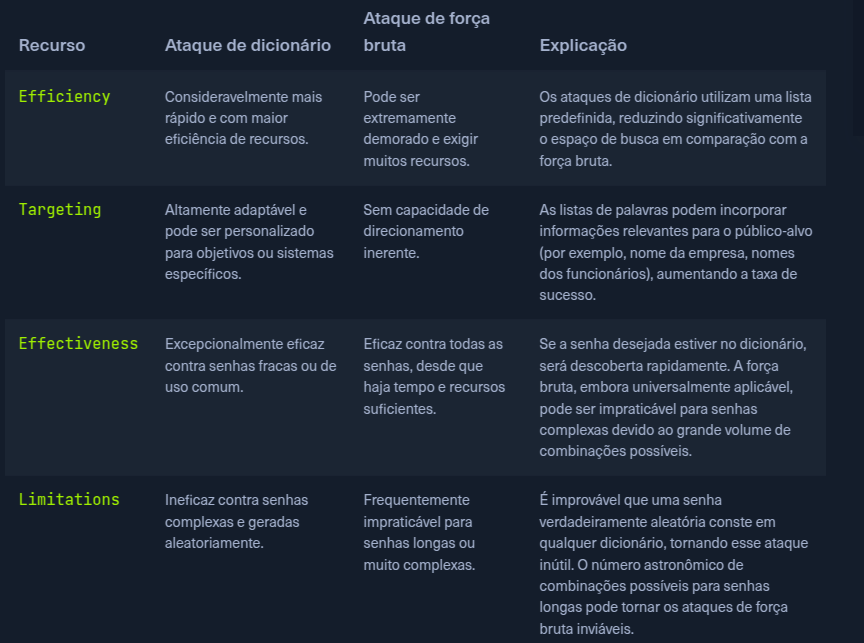

# Ataques com Dicionário

## Introdução

Ataques com força bruta podem ser demoradas e exigem muitos recursos do equipemento, para lidar com isso, realizamos os ataques com dicionários.

O conteudo do dicionário é uma tentativa de prever as senhas baseadas em palavras de dicionário, frases comuns, nomes ou padrões. Ao realizar a engenharia social, é possível adicionar ao dicionário palavras chaves, como datas de nascimentos, nome do cachorro ou comida favorita.

Quanto mais a lista de palavras refletir as prováveis ​​escolhas de senhas do alvo, maiores serão as chances de um ataque bem-sucedido.

## Brute Force vs Dictionary Attack

A diferença entre força bruta e ataque com dicionário está na metolodogia para gerar possíveis senhas:

- **Brute Force**: Um ataque de força bruta pura testa sistematicamente todas as combinações possíveis de caracteres dentro de um conjunto e comprimento predeterminados. Embora essa abordagem garanta sucesso eventual com tempo suficiente, ela pode ser extremamente demorada, principalmente contra senhas longas ou complexas.

- **Dictionary Attack**: Um ataque de dicionário emprega uma lista pré-compilada de palavras e frases, reduzindo drasticamente o espaço de busca. Essa metodologia direcionada resulta em um ataque muito mais eficiente e rápido, especialmente quando se suspeita que a senha alvo seja uma palavra ou frase comum.



## Listas Disponíveis Publicamente

### Repositório Principal

- **SecLists**: https://github.com/danielmiessler/SecLists/tree/master/Passwords

### Listas Específicas

- **rockyou**: Lista com senhas populares de senhas vazadas da RockYou
  - https://github.com/brannondorsey/naive-hashcat/releases/tag/data

- **Lista de usuários comuns**:
  - https://github.com/danielmiessler/SecLists/blob/master/Usernames/top-usernames-shortlist.txt

- **Lista extensa de usuários** (cerca de 10 milhões):
  - https://github.com/danielmiessler/SecLists/blob/master/Usernames/xato-net-10-million-usernames.txt

- **As senhas mais usadas de 2023**:
  - https://github.com/danielmiessler/SecLists/blob/master/Passwords/Common-Credentials/2023-200_most_used_passwords.txt

- **Senhas e usuários padrão** de roteadores, softwares e afins:
  - https://github.com/danielmiessler/SecLists/blob/master/Passwords/Default-Credentials/default-passwords.csv
  - https://github.com/danielmiessler/SecLists/blob/master/Passwords/Default-Credentials/default-passwords.txt

## Script Python para Ataque com Dicionário

Script python HTB para atacar uma aplicação para testes:

```python
import requests

ip = "127.0.0.1"  # Change this to your instance IP address
port = 1234       # Change this to your instance port number

# Download a list of common passwords from the web and split it into lines
passwords = requests.get("https://raw.githubusercontent.com/danielmiessler/SecLists/refs/heads/master/Passwords/Common-Credentials/500-worst-passwords.txt").text.splitlines()

# Try each password from the list
for password in passwords:
    print(f"Attempted password: {password}")

    # Send a POST request to the server with the password
    response = requests.post(f"http://{ip}:{port}/dictionary", data={'password': password})

    # Check if the server responds with success and contains the 'flag'
    if response.ok and 'flag' in response.json():
        print(f"Correct password found: {password}")
        print(f"Flag: {response.json()['flag']}")
        break
```