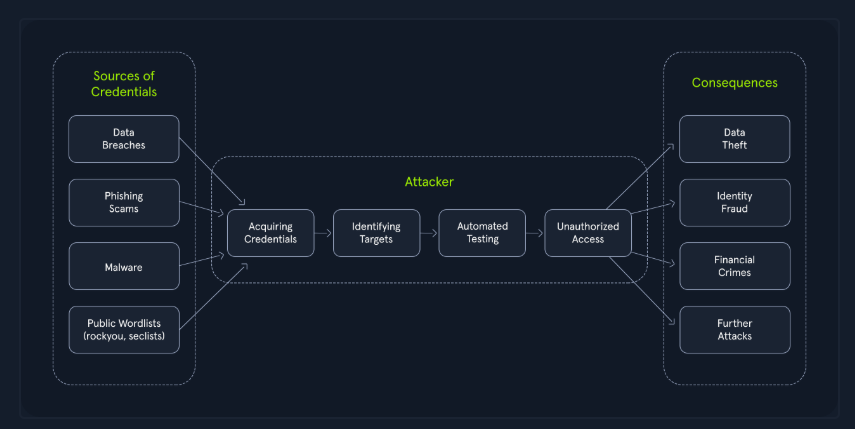

# Ataques Híbridos

## O Problema das Políticas de Senha

Muitas organizações implementam políticas que exigem que os usuários alterem suas senhas periodicamente para aumentar a segurança. No entanto, essas políticas podem, inadvertidamente, gerar padrões de senhas previsíveis se os usuários não forem adequadamente instruídos sobre a importância de criar senhas seguras.

### Padrões Previsíveis de Senha

Infelizmente, uma prática comum e insegura entre os usuários é fazer pequenas alterações em suas senhas quando são obrigados a trocá-las. Isso geralmente se manifesta como a adição de um número ou um caractere especial ao final da senha atual.

**Exemplo:**
- Senha original: `Verão2023`
- Primeira alteração: `Verão2023!`
- Segunda alteração: `Verão2024`

Esse comportamento previsível cria uma brecha que ataques híbridos podem explorar impiedosamente. Os atacantes se aproveitam dessa tendência humana empregando técnicas sofisticadas que combinam os pontos fortes de ataques de dicionário e de força bruta, aumentando drasticamente a probabilidade de obterem sucesso em violações de senhas.

---

## Ataques Híbridos em Ação

### Como Funciona

Considere um atacante visando uma organização conhecida por exigir alterações regulares de senha:

1. **Ataque de Dicionário Inicial**
   - Utiliza lista de palavras com senhas comuns
   - Termos específicos do setor
   - Informações pessoais relacionadas à organização

2. **Transição para Força Bruta Direcionada**
   - Modifica estrategicamente palavras da lista original
   - Adiciona números e caracteres especiais
   - Incrementa anos (2023 → 2024)

Essa abordagem de força bruta direcionada reduz drasticamente o espaço de busca em comparação com um ataque de força bruta tradicional, ao mesmo tempo que abrange muitas variações potenciais de senhas.

---

## O Poder dos Ataques Híbridos

A eficácia dos ataques híbridos reside na sua **adaptabilidade e eficiência**. Eles aproveitam os pontos fortes das técnicas de dicionário e de força bruta, maximizando as chances de quebrar senhas, especialmente em cenários onde os usuários seguem padrões previsíveis.

### Exemplo Prático: Filtragem por Política de Senha

Considere uma organização com a seguinte política de senhas:

**Requisitos:**
- Comprimento mínimo: 8 caracteres
- Pelo menos uma letra maiúscula
- Pelo menos uma letra minúscula
- Pelo menos um número

### Filtrando Wordlist com `grep`

#### 1. Baixar wordlist

```bash
wget https://raw.githubusercontent.com/danielmiessler/SecLists/refs/heads/master/Passwords/Common-Credentials/darkweb2017_top-10000.txt
```

#### 2. Filtrar por comprimento mínimo (8 caracteres)

```bash
grep -E '^.{8,}$' darkweb2017-top10000.txt > darkweb2017-minlength.txt
```

**Explicação:** A expressão regular `^.{8,}$` garante que apenas senhas com pelo menos 8 caracteres sejam processadas.

#### 3. Filtrar por letra maiúscula

```bash
grep -E '[A-Z]' darkweb2017-minlength.txt > darkweb2017-uppercase.txt
```

**Explicação:** `[A-Z]` garante que a senha contenha pelo menos uma letra maiúscula.

#### 4. Filtrar por letra minúscula

```bash
grep -E '[a-z]' darkweb2017-uppercase.txt > darkweb2017-lowercase.txt
```

**Explicação:** `[a-z]` mantém apenas senhas com pelo menos uma letra minúscula.

#### 5. Filtrar por número

```bash
grep -E '[0-9]' darkweb2017-lowercase.txt > darkweb2017-number.txt
```

**Explicação:** `[0-9]` garante que a senha contenha pelo menos um dígito numérico.

#### 6. Contar senhas resultantes

```bash
wc -l darkweb2017-number.txt
```

**Resultado:**
```
89 darkweb2017-number.txt
```

### Análise do Resultado

A filtragem reduziu drasticamente a lista de **10.000 senhas para apenas 89** que atendem à política de senhas. Essa redução representa:

- ✅ Aumento significativo na eficiência do ataque
- ✅ Ataque mais rápido e focado
- ✅ Otimização de recursos computacionais
- ✅ Maior probabilidade de sucesso

---

## Credential Stuffing: Aproveitando Dados Roubados

### O Que É

Os ataques de **credential stuffing** (preenchimento de credenciais) exploram a prática comum de reutilização de senhas em diversas contas online.

### Como Funciona



**1. Obtenção de Credenciais**
- Vazamentos de dados (data breaches)
- Golpes de phishing
- Malware
- Wordlists públicas (`rockyou.txt`, SecLists)

**2. Identificação de Alvos**
- Redes sociais
- Provedores de e-mail
- Bancos online
- Sites de comércio eletrônico

**3. Fase Automatizada**
- Ferramentas testam credenciais sistematicamente
- Imitam comportamento normal do usuário
- Evitam detecção

**4. Exploração do Acesso**
- Roubo de dados
- Fraude de identidade
- Crimes financeiros
- Disseminação de malware
- Infiltração em sistemas conectados

---

## O Problema da Reutilização de Senhas

A principal questão que alimenta o sucesso do credential stuffing é a **prática generalizada de reutilização de senhas**. 

### Efeito Dominó

Quando os usuários utilizam senhas iguais ou semelhantes para várias contas:
- Uma violação em uma plataforma compromete inúmeras outras contas
- Acesso não autorizado se espalha rapidamente
- Danos multiplicados em cascata

### Proteções Necessárias

- ✅ Senhas fortes e **exclusivas** para cada serviço
- ✅ Autenticação multifator (MFA/2FA)
- ✅ Gerenciadores de senha
- ✅ Monitoramento de vazamentos (Have I Been Pwned)
- ✅ Educação sobre segurança de senhas

