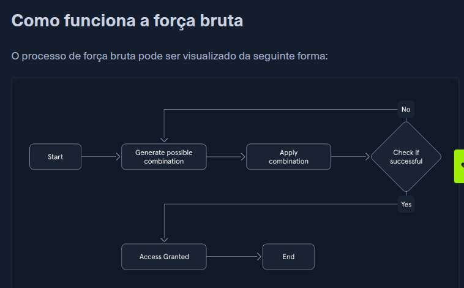
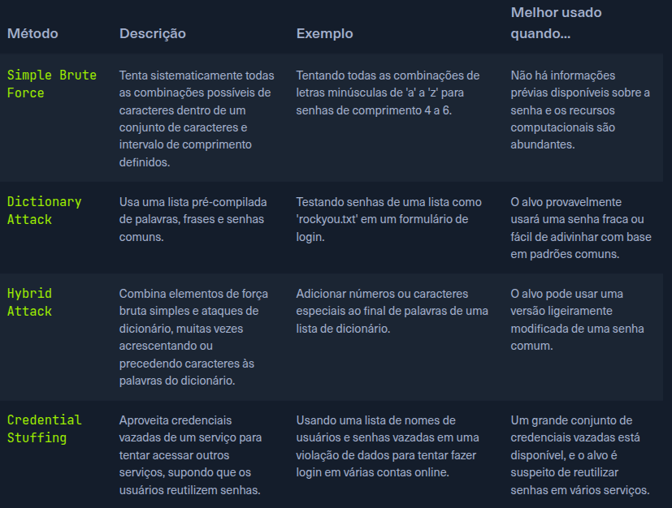
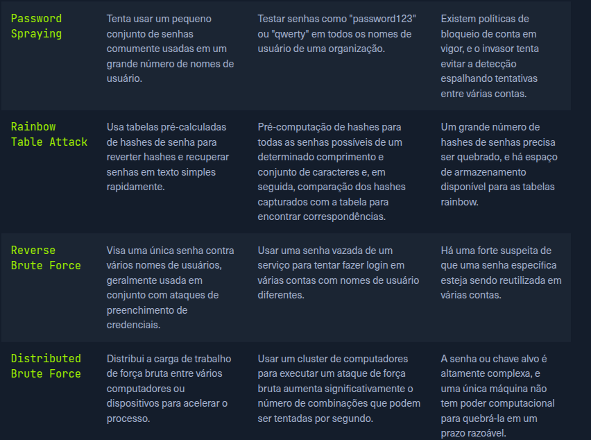

# Brute force

Força bruta é um método de tentativa e erro usado para quebrar senhas, credenciais de login ou chaves de criptografia, envolve tentar todas as combinações possíveis de caracteres até encontrar a correta.

O sucesso do ataque depende de alguns fatores

- **Complexidade da senha**
- **Poder computacional**
- **Medidas de segurança**

## Como funciona a força bruta

1) Start: O processo inicia com a ajuda de um software

2) Generate Possible Combination: O software gera uma possível senha ou combinação de chaves com base em parâmetros predefinidos.

3) Apply Combination: A combinação gerada é tentada contra o sistema, em formulários de login ou arquivos criptografados

4) Check if Succesful: O sistema avalia a combinação tentada, se obeter sucesso, o acesso é concedido.

5) Access Granted: O invasor obtém acesso não autorizado ao sistema ou aos dados.

6) End: O processo se repete, gerando e testando novas combinações até que a correta seja encontrada ou o invasor desista

## Tipos de força bruta

Possui um conjunto diverso de técnicas, cada uma tendo seu ponto forte, fraco e caso de uso

## O papel da força bruta nos testes de penetração

- **Politicas de senha fraca** : Se o sistema alvo empregar políticas fracas ou mediocras, aumenta a probabilidade dos usuários possuierem senhas fracas ou fáceis de prever, a força bruta expôe efetivamente essas vulnerabilidades.

- **Quando não há alternativa** : Tentativas iniciais como explorar vulnerabilides ou engenharia social podem não funcionar, tento que recorrer a força bruta.

- **Atacar contas específicas** : Da para atingir contas com privilégios altos, como  contas root.
