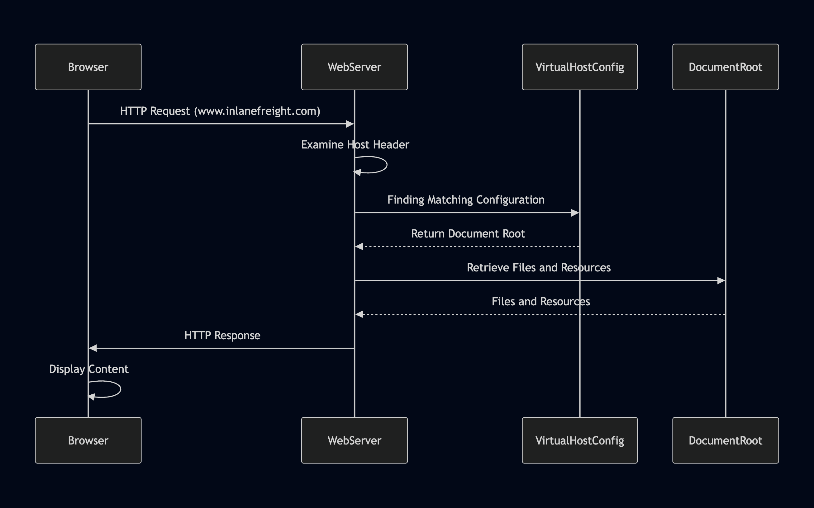

# Virtual Hosts

Uma vez que o DNS direciona o tráfego para o servidor correto, a configuração do servidor web se torna crucial para determinar como as requisições recebidas são tratadas. Servidores web como Apache, Nginx ou IIS são projetados para hospedar múltiplos sites ou aplicações em um único servidor. Eles conseguem isso através de hospedagem virtual, que permite diferenciar entre domínios, subdomínios ou até mesmo sites separados com conteúdo distinto.

## Como os Virtual Hosts Funcionam: Entendendo VHosts e Subdomínios

No núcleo da hospedagem virtual está a capacidade dos servidores web de distinguir entre múltiplos sites ou aplicações compartilhando o mesmo endereço IP. Isso é alcançado aproveitando o cabeçalho HTTP Host, uma informação incluída em toda requisição HTTP enviada por um navegador web.

A diferença chave entre VHosts e subdomínios é sua relação com o Sistema de Nomes de Domínio (DNS) e a configuração do servidor web.

**Subdomínios:** São extensões de um nome de domínio principal (ex: blog.example.com é um subdomínio de example.com). Subdomínios tipicamente têm seus próprios registros DNS, apontando para o mesmo endereço IP do domínio principal ou para um diferente. Podem ser usados para organizar diferentes seções ou serviços de um site.

**Virtual Hosts (VHosts):** Virtual hosts são configurações dentro de um servidor web que permitem múltiplos sites ou aplicações serem hospedados em um único servidor. Podem ser associados com domínios de nível superior (ex: example.com) ou subdomínios (ex: dev.example.com). Cada virtual host pode ter sua própria configuração separada, permitindo controle preciso sobre como as requisições são tratadas.

Se um virtual host não tem um registro DNS, você ainda pode acessá-lo modificando o arquivo hosts na sua máquina local. O arquivo hosts permite mapear um nome de domínio para um endereço IP manualmente, ignorando a resolução DNS.

Sites frequentemente têm subdomínios que não são públicos e não aparecerão em registros DNS. Esses subdomínios são acessíveis apenas internamente ou através de configurações específicas. VHost fuzzing é uma técnica para descobrir subdomínios e VHosts públicos e não-públicos testando vários hostnames contra um endereço IP conhecido.

Virtual hosts também podem ser configurados para usar diferentes domínios, não apenas subdomínios. Por exemplo:

```apacheconf
# Exemplo de configuração de virtual host baseado em nome no Apache
<VirtualHost *:80>
    ServerName www.example1.com
    DocumentRoot /var/www/example1
</VirtualHost>

<VirtualHost *:80>
    ServerName www.example2.org
    DocumentRoot /var/www/example2
</VirtualHost>

<VirtualHost *:80>
    ServerName www.another-example.net
    DocumentRoot /var/www/another-example
</VirtualHost>
```

Aqui, example1.com, example2.org e another-example.net são domínios distintos hospedados no mesmo servidor. O servidor web usa o cabeçalho Host para servir o conteúdo apropriado baseado no nome de domínio requisitado.

## Lookup de VHost no Servidor

O seguinte ilustra o processo de como um servidor web determina o conteúdo correto a servir baseado no cabeçalho Host:



Diagrama de sequência mostrando interações entre Navegador, ServidorWeb, ConfigVirtualHost e DocumentRoot. Inclui requisição HTTP, resposta do servidor e etapas de acesso a arquivos.

1. **Navegador Requisita um Site:** Quando você digita um nome de domínio (ex: www.inlanefreight.com) no seu navegador, ele inicia uma requisição HTTP para o servidor web associado ao endereço IP daquele domínio.

2. **Cabeçalho Host Revela o Domínio:** O navegador inclui o nome de domínio no cabeçalho Host da requisição, que atua como um rótulo para informar ao servidor web qual site está sendo requisitado.

3. **Servidor Web Determina o Virtual Host:** O servidor web recebe a requisição, examina o cabeçalho Host, e consulta sua configuração de virtual host para encontrar uma entrada correspondente para o nome de domínio requisitado.

4. **Servindo o Conteúdo Correto:** Ao identificar a configuração correta do virtual host, o servidor web recupera os arquivos e recursos correspondentes associados àquele site do seu document root e os envia de volta ao navegador como resposta HTTP.

Em essência, o cabeçalho Host funciona como um interruptor, permitindo ao servidor web determinar dinamicamente qual site servir baseado no nome de domínio requisitado pelo navegador.

## Tipos de Virtual Hosting

Existem três tipos primários de hospedagem virtual, cada um com suas vantagens e desvantagens:

**Virtual Hosting Baseado em Nome:** Este método depende exclusivamente do cabeçalho HTTP Host para distinguir entre sites. É o método mais comum e flexível, já que não requer múltiplos endereços IP. É econômico, fácil de configurar e suporta a maioria dos servidores web modernos. Entretanto, requer que o servidor web suporte hospedagem virtual baseada em nome e pode ter limitações com certos protocolos como SSL/TLS.

**Virtual Hosting Baseado em IP:** Este tipo de hospedagem atribui um endereço IP único para cada site hospedado no servidor. O servidor determina qual site servir baseado no endereço IP para o qual a requisição foi enviada. Não depende do cabeçalho Host, pode ser usado com qualquer protocolo e oferece melhor isolamento entre sites. Ainda assim, requer múltiplos endereços IP, o que pode ser caro e menos escalável.

**Virtual Hosting Baseado em Porta:** Diferentes sites são associados a diferentes portas no mesmo endereço IP. Por exemplo, um site pode ser acessível na porta 80, enquanto outro está na porta 8080. Hospedagem virtual baseada em porta pode ser usada quando endereços IP são limitados, mas não é tão comum ou amigável quanto hospedagem virtual baseada em nome e pode requerer que usuários especifiquem o número da porta na URL.

## Ferramentas de Descoberta de Virtual Host

Enquanto análise manual de cabeçalhos HTTP e lookups DNS reverso podem ser efetivos, ferramentas especializadas de descoberta de virtual host automatizam e simplificam o processo, tornando-o mais eficiente e abrangente. Essas ferramentas empregam várias técnicas para sondar o servidor alvo e descobrir virtual hosts potenciais.

Várias ferramentas estão disponíveis para auxiliar na descoberta de virtual hosts:

| Ferramenta | Descrição | Recursos |
|------------|-----------|----------|
| gobuster | Ferramenta multiuso frequentemente usada para força bruta de diretórios/arquivos, mas também eficaz para descoberta de virtual host. | Rápida, suporta múltiplos métodos HTTP, pode usar wordlists customizadas. |
| Feroxbuster | Similar ao Gobuster, mas com implementação em Rust, conhecida por sua velocidade e flexibilidade. | Suporta recursão, descoberta de wildcard e vários filtros. |
| ffuf | Outro fuzzer web rápido que pode ser usado para descoberta de virtual host através de fuzzing do cabeçalho Host. | Entrada de wordlist customizável e opções de filtragem. |

## gobuster

Gobuster é uma ferramenta versátil comumente usada para força bruta de diretórios e arquivos, mas também se destaca na descoberta de virtual hosts. Ela sistematicamente envia requisições HTTP com diferentes cabeçalhos Host para um endereço IP alvo e então analisa as respostas para identificar virtual hosts válidos.

Há algumas coisas que você precisa preparar para fazer força bruta em cabeçalhos Host:

1. **Identificação do Alvo:** Primeiro, identifique o endereço IP do servidor web alvo. Isso pode ser feito através de lookups DNS ou outras técnicas de reconhecimento.

2. **Preparação da Wordlist:** Prepare uma wordlist contendo nomes potenciais de virtual hosts. Você pode usar uma wordlist pré-compilada, como SecLists, ou criar uma customizada baseada na indústria do alvo, convenções de nomenclatura ou outras informações relevantes.

O comando gobuster para fazer força bruta em vhosts geralmente se parece com isso:

```bash
gobuster vhost -u http://<endereço_IP_alvo> -w <arquivo_wordlist> --append-domain
```

- A flag `-u` especifica a URL alvo (substitua `<endereço_IP_alvo>` pelo IP real).
- A flag `-w` especifica o arquivo wordlist (substitua `<arquivo_wordlist>` pelo caminho para sua wordlist).
- A flag `--append-domain` anexa o domínio base a cada palavra na wordlist.

Em versões mais novas do Gobuster, a flag `--append-domain` é necessária para anexar o domínio base a cada palavra na wordlist ao realizar descoberta de virtual host. Esta flag garante que o Gobuster construa corretamente os hostnames virtuais completos, o que é essencial para enumeração precisa de subdomínios potenciais. Em versões mais antigas do Gobuster, essa funcionalidade era tratada diferentemente, e a flag `--append-domain` não era necessária. Usuários de versões mais antigas podem não encontrar esta flag disponível ou necessária, já que a ferramenta anexava o domínio base por padrão ou empregava um mecanismo diferente para geração de virtual hosts.

Gobuster irá exibir virtual hosts potenciais conforme os descobre. Analise os resultados cuidadosamente, notando quaisquer descobertas incomuns ou interessantes. Investigação adicional pode ser necessária para confirmar a existência e funcionalidade dos virtual hosts descobertos.

Há alguns outros argumentos que vale a pena conhecer:

- Considere usar a flag `-t` para aumentar o número de threads para varredura mais rápida.
- A flag `-k` pode ignorar erros de certificado SSL/TLS.
- Você pode usar a flag `-o` para salvar a saída em um arquivo para análise posterior.

```bash
gobuster vhost -u http://inlanefreight.htb:81 -w /usr/share/seclists/Discovery/DNS/subdomains-top1million-110000.txt --append-domain
===============================================================
Gobuster v3.6
by OJ Reeves (@TheColonial) & Christian Mehlmauer (@firefart)
===============================================================
[+] Url:             http://inlanefreight.htb:81
[+] Method:          GET
[+] Threads:         10
[+] Wordlist:        /usr/share/seclists/Discovery/DNS/subdomains-top1million-110000.txt
[+] User Agent:      gobuster/3.6
[+] Timeout:         10s
[+] Append Domain:   true
===============================================================
Starting gobuster in VHOST enumeration mode
===============================================================
Found: forum.inlanefreight.htb:81 Status: 200 [Size: 100]
[...]
Progress: 114441 / 114442 (100.00%)
===============================================================
Finished
===============================================================
```

Descoberta de virtual host pode gerar tráfego significativo e pode ser detectada por sistemas de detecção de intrusão (IDS) ou firewalls de aplicação web (WAF). Tenha cautela e obtenha autorização adequada antes de escanear quaisquer alvos.
