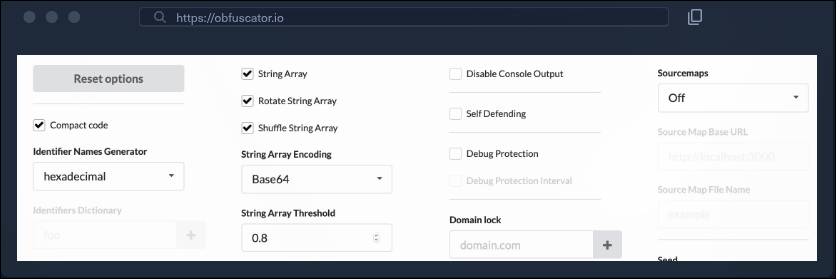
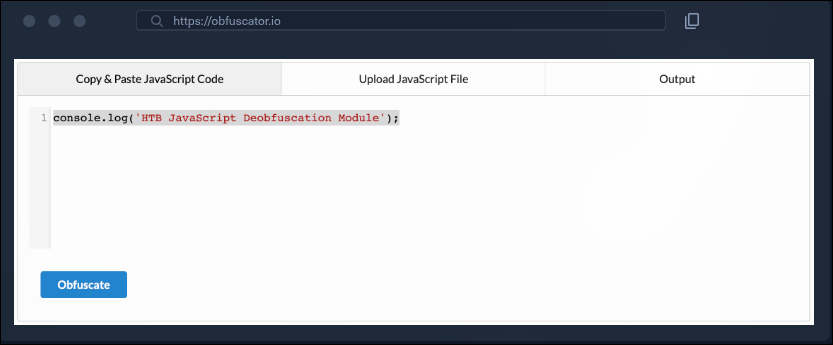
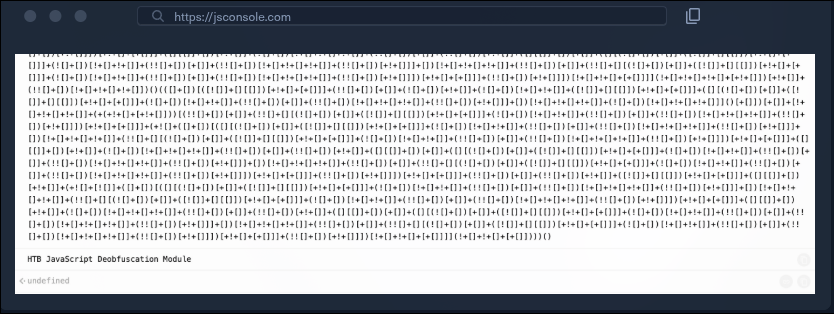

# Ofuscação avançada

Até agora, conseguimos ofuscar nosso código e torná-lo mais difícil de ler. Entretanto, o código ainda contém strings em texto claro, que podem revelar sua funcionalidade original. Nesta seção, experimentaremos algumas ferramentas capazes de ofuscar completamente o código e ocultar quaisquer vestígios de sua funcionalidade original.

## Obfuscator

Vamos acessar https://obfuscator.io. Antes de clicarmos em **Obfuscate**, alteraremos **String Array Encoding** para **Base64**, como mostrado abaixo:

Agora podemos colar nosso código e clicar em **Obfuscate**:

Obtemos o seguinte código:

~~~javascript
var _0x1ec6=['Bg9N','sfrciePHDMfty3jPChqGrgvVyMz1C2nHDgLVBIbnB2r1Bgu='];(function(_0x13249d,_0x1ec6e5){var _0x14f83b=function(_0x3f720f){while(--_0x3f720f){_0x13249d['push'](_0x13249d['shift']());}};_0x14f83b(++_0x1ec6e5);}(_0x1ec6,0xb4));var _0x14f8=function(_0x13249d,_0x1ec6e5){_0x13249d=_0x13249d-0x0;var _0x14f83b=_0x1ec6[_0x13249d];if(_0x14f8['eOTqeL']===undefined){var _0x3f720f=function(_0x32fbfd){var _0x523045='abcdefghijklmnopqrstuvwxyzABCDEFGHIJKLMNOPQRSTUVWXYZ0123456789+/=',_0x4f8a49=String(_0x32fbfd)['replace'](/=+$/,'');var _0x1171d4='';for(var _0x44920a=0x0,_0x2a30c5,_0x443b2f,_0xcdf142=0x0;_0x443b2f=_0x4f8a49['charAt'](_0xcdf142++);~_0x443b2f&&(_0x2a30c5=_0x44920a%0x4?_0x2a30c5*0x40+_0x443b2f:_0x443b2f,_0x44920a++%0x4)?_0x1171d4+=String['fromCharCode'](0xff&_0x2a30c5>>(-0x2*_0x44920a&0x6)):0x0){_0x443b2f=_0x523045['indexOf'](_0x443b2f);}return _0x1171d4;};_0x14f8['oZlYBE']=function(_0x8f2071){var _0x49af5e=_0x3f720f(_0x8f2071);var _0x52e65f=[];for(var _0x1ed1cf=0x0,_0x79942e=_0x49af5e['length'];_0x1ed1cf<_0x79942e;_0x1ed1cf++){_0x52e65f+='%'+('00'+_0x49af5e['charCodeAt'](_0x1ed1cf)['toString'](0x10))['slice'](-0x2);}return decodeURIComponent(_0x52e65f);},_0x14f8['qHtbNC']={},_0x14f8['eOTqeL']=!![];}var _0x20247c=_0x14f8['qHtbNC'][_0x13249d];return _0x20247c===undefined?(_0x14f83b=_0x14f8['oZlYBE'](_0x14f83b),_0x14f8['qHtbNC'][_0x13249d]=_0x14f83b):_0x14f83b=_0x20247c,_0x14f83b;};console[_0x14f8('0x0')](_0x14f8('0x1'));
~~~

Esse código está claramente mais ofuscado, e não conseguimos ver nenhum vestígio do código original. Agora podemos tentar executá-lo em https://jsconsole.com para verificar se ele ainda realiza sua função original. Experimente diferentes configurações de ofuscação em https://obfuscator.io para gerar um código ainda mais ofuscado e execute-o novamente em https://jsconsole.com para verificar se continua realizando sua função original.

## Mais ofuscação

Agora devemos ter uma ideia clara de como a ofuscação de código funciona. Ainda existem muitas variações de ferramentas de ofuscação, e cada uma delas ofusca o código de maneira diferente. Considere, por exemplo, o seguinte código JavaScript:

~~~javascript
[][(![]+[])[+[]]+([![]]+[][[]])[+!+[]+[+[]]]+(![]+[])[!+[]+!+[]]+(!![]+[])[+[]]+(!![]+[])[!+[]+!+[]+!+[]]+(!![]+[])[+!+[]]][([][(![]+[])[+[]]+([![]]+[][[]])[+!+[]+[+[]]]+(![]+[])[!+[]+!+[]]+(!![]+[])[+[]]+(!![]+[])[!+[]+!+[]+!+[]]+(!![]+[])[+!+[]]]+[])[!+[]+!+[]+!+[]]+(!![]+[][(![]+[])[+[]]+([![]]+[][[]])[+!+[]+[+[]]]+(![]+[])[!+[]+!+[]]+(!![]+[])[+[]]+(!![]+[])[!+[]+!+[]+!+[]]+(!![]+[])[+!+[]]])[+!+[]+[+[]]]+([][[]]+[])[+!+[]]+(![]+[])[!+[]+!+[]+!+[]]+(!![]+[])[+[]]+(!![]+[])[+!+[]]+([][[]]+[])[+[]]+([][(!
...SNIP...
[]]+(!![]+[][(![]+[])[+[]]+([![]]+[][[]])[+!+[]+[+[]]]+(![]+[])[!+[]+!+[]]+(!![]+[])[+[]]+(!![]+[])[!+[]+!+[]+!+[]]+(!![]+[])[+!+[]]])[+!+[]+[+[]]]+([][[]]+[])[+!+[]]+(![]+[])[!+[]+!+[]+!+[]]+(!![]+[])[+[]]+(!![]+[])[+!+[]]+([][[]]+[])[+[]]+([][(![]+[])[+[]]+([![]]+[][[]])[+!+[]+[+[]]]+(![]+[])[!+[]+!+[]]+(!![]+[])[+[]]+(!![]+[])[!+[]+!+[]+!+[]]+(!![]+[])[+!+[]]]+[])[!+[]+!+[]+!+[]]+(!![]+[])[+[]]+(!![]+[][(![]+[])[+[]]+([![]]+[][[]])[+!+[]+[+[]]]+(![]+[])[!+[]+!+[]]+(!![]+[])[+[]]+(!![]+[])[!+[]+!+[]+!+[]]+(!![]+[])[+!+[]]])[+!+[]+[+[]]]+(!![]+[])[+!+[]]])[!+[]+!+[]+[+[]]]](!+[]+!+[]+[+[]])))()
~~~

Ainda podemos executar esse código, e ele continuará realizando sua função original:

> **Observação:** o código acima foi cortado porque o código completo é muito longo, mas sua versão completa deverá ser executada com sucesso.

Podemos tentar ofuscar o código usando a mesma ferramenta em JSF e depois executá-lo novamente. Perceberemos que o código poderá levar algum tempo para ser executado, o que demonstra como a ofuscação pode afetar o desempenho, conforme mencionado anteriormente.

Existem muitos outros ofuscadores JavaScript, como JJ Encode e AA Encode. Entretanto, esses ofuscadores normalmente tornam a execução ou compilação do código muito lenta, portanto seu uso não é recomendado, a menos que exista uma razão evidente, como contornar filtros ou restrições web.
