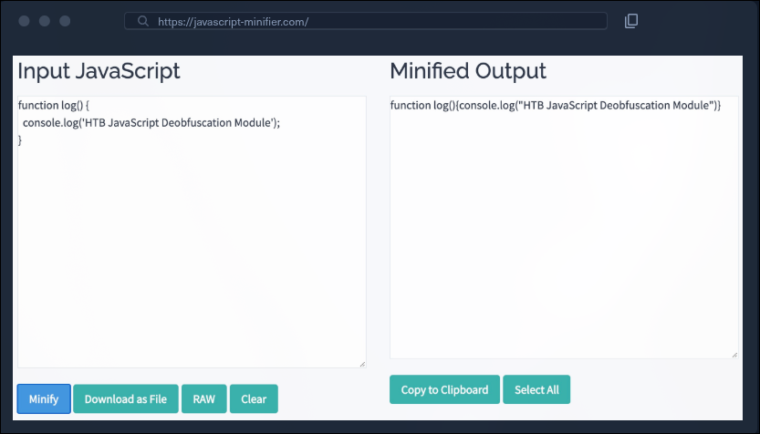
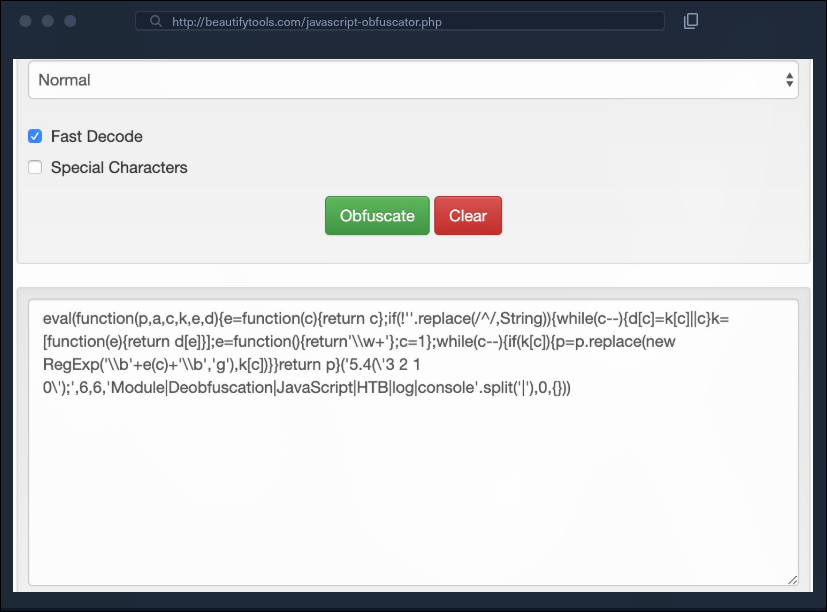
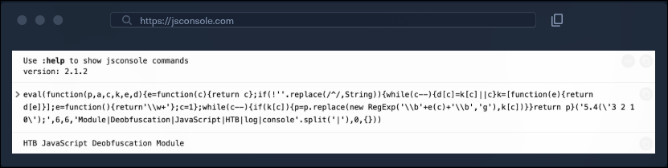

# Resumo geral — JavaScript Deobfuscation

## Objetivo deste material

Este documento consolida todo o percurso do módulo de JavaScript Deobfuscation: localizar código executado no navegador, reconhecer diferentes formas de ofuscação, recuperar uma versão legível, entender o comportamento real do programa, reproduzir suas requisições HTTP e decodificar dados encontrados durante a análise.

Desofuscar não significa apenas aplicar indentação. O objetivo final é responder com segurança e evidências:

- Onde o código está localizado?
- Como ele é carregado e executado?
- Quais transformações dificultam sua leitura?
- Quais strings, funções e endpoints estão escondidos?
- Que dados entram no programa?
- Que dados saem dele?
- Quais requisições de rede são realizadas?
- Qual comportamento precisa ser reproduzido para confirmar a análise?

O fluxo completo pode ser resumido assim:

~~~text
localizar o JavaScript
        ↓
preservar o original
        ↓
formatar e reconhecer padrões
        ↓
remover camadas de ofuscação
        ↓
decodificar strings e dados
        ↓
analisar funções e fluxo
        ↓
reproduzir requisições
        ↓
confirmar o comportamento
~~~

## 1. O papel de HTML, CSS e JavaScript

Uma aplicação web no lado do cliente normalmente combina:

| Tecnologia | Responsabilidade predominante |
| --- | --- |
| HTML | Estrutura, conteúdo, campos, formulários e referências a recursos |
| CSS | Aparência, cores, dimensões, tipografia e layout |
| JavaScript | Lógica, eventos, comunicação HTTP e manipulação do DOM |

O código de front-end precisa ser entregue ao navegador. Por isso, HTML, CSS e JavaScript utilizados no cliente podem ser baixados e inspecionados pelo usuário.

Isso é diferente do back-end. Código PHP, Python, Java ou de outra tecnologia executada no servidor normalmente não é enviado ao navegador; o cliente recebe apenas a resposta produzida por ele.

### Consequência de segurança

Nenhum segredo deve depender exclusivamente de estar escondido em JavaScript. Se o navegador precisa executar uma lógica, um analista também pode:

- baixar o arquivo;
- formatá-lo;
- acompanhar sua execução;
- interceptar valores em runtime;
- observar requisições;
- reproduzir sua funcionalidade.

Ofuscação pode elevar o custo da análise, mas não transforma código do cliente em código secreto.

## 2. Localizando o código-fonte

O laboratório começa em:

~~~text
http://SERVER_IP:PORT
~~~

A página exibe **Secret Serial Generator**, mas não apresenta controles visíveis que expliquem sua funcionalidade. Nessa situação, a interface é apenas o ponto inicial; é necessário examinar os recursos carregados.

### View Source

O atalho apresentado no módulo é:

~~~text
CTRL + U
~~~

Também é possível usar:

~~~text
view-source:http://SERVER_IP:PORT
~~~

O código-fonte HTML pode revelar:

- comentários de desenvolvedores;
- caminhos para arquivos JavaScript e CSS;
- formulários e parâmetros;
- elementos ocultos;
- endpoints;
- metadados;
- versões de bibliotecas;
- nomes de funcionalidades ainda não expostas.

Comentários HTML não são privados. Tokens, senhas, chaves, rotas administrativas e anotações internas nunca devem ser enviados ao cliente supondo que permanecerão escondidos.

### View Source versus DOM renderizado

É fundamental distinguir:

- **View Source:** resposta HTML originalmente recebida do servidor;
- **Inspector/Elements:** DOM atual, já modificado por JavaScript;
- **Sources/Debugger:** scripts carregados e código em execução;
- **Network:** requisições, respostas, headers e tempos.

Se JavaScript criar ou remover elementos depois do carregamento, a alteração aparecerá no Inspector, mas poderá não existir no View Source.

### CSS interno e externo

CSS interno:

~~~html

~~~

CSS externo:

~~~html
<head>
    <link rel="stylesheet" href="style.css">
</head>
~~~

O atributo **href** aponta para o recurso externo.

### JavaScript interno e externo

JavaScript interno fica entre tags **script**. Um arquivo externo é referenciado por **src**:

~~~html

~~~

Ao encontrar essa referência, o próximo passo é abrir **secret.js** diretamente ou localizá-lo nas abas Sources e Network.

## 3. Conceitos que não devem ser confundidos

| Conceito | Finalidade principal | Precisa de segredo? | É normalmente reversível? |
| --- | --- | --- | --- |
| Minificação | Reduzir tamanho e melhorar entrega | Não | Em grande parte, com formatação |
| Ofuscação | Dificultar leitura e engenharia reversa | Não | Sim, com esforço variável |
| Codificação | Representar dados em outro formato | Não | Sim |
| Criptografia | Proteger confidencialidade com algoritmo e chave | Sim | Sim, com a chave correta |
| Hashing | Gerar um resumo para comparação/integridade | Não da mesma forma | Normalmente não |
| Compilação | Traduzir código para outra representação executável | Não necessariamente | Depende do formato |

Essas técnicas podem aparecer combinadas. Um JavaScript pode estar minificado, empacotado, conter strings em Base64 e ainda usar criptografia em parte do fluxo.

### Regra mental

Se qualquer pessoa consegue recuperar o valor seguindo um procedimento público e sem possuir uma chave secreta, provavelmente estamos diante de codificação ou ofuscação, não de criptografia.

## 4. O que é ofuscação

Ofuscação transforma o código para dificultar a compreensão humana, preservando seu comportamento.

Transformações comuns:

- renomear variáveis e funções;
- mover strings para arrays;
- acessar propriedades indiretamente;
- reconstruir palavras durante a execução;
- codificar strings;
- rotacionar ou embaralhar tabelas;
- alterar o fluxo de controle;
- inserir código irrelevante;
- usar coerções de tipos;
- gerar e executar código dinamicamente.

### Motivos legítimos

- dificultar cópia direta;
- elevar o custo de engenharia reversa;
- proteger parcialmente propriedade intelectual;
- distribuir aplicações em ambientes não controlados;
- desencorajar alterações triviais.

### Uso malicioso

Scripts maliciosos também podem usar ofuscação para esconder:

- URLs;
- payloads adicionais;
- nomes de APIs;
- coleta de dados;
- exfiltração;
- indicadores reconhecidos por assinaturas simples.

A presença de ofuscação não prova intenção maliciosa. Ela indica que o comportamento exige investigação.

### Limitação central

Autenticação e autorização devem ser validadas no servidor. Uma verificação presente apenas no cliente pode ser estudada, alterada ou ignorada.

Chaves secretas incorporadas ao JavaScript também podem ser recuperadas em análise estática ou durante a execução.

## 5. Estabelecendo uma referência funcional

Antes de transformar ou desofuscar um programa, é útil conhecer seu comportamento esperado.

Código básico do laboratório:

~~~javascript
console.log('HTB JavaScript Deobfuscation Module');
~~~

Ele pode ser executado em:

~~~text
https://jsconsole.com
~~~

Saída esperada:

~~~text
HTB JavaScript Deobfuscation Module
~~~

Essa saída funciona como referência. Depois de minificar ou ofuscar o código, ele deve continuar produzindo o mesmo resultado.

## 6. Minificação

Minificação coloca o código em uma representação compacta, normalmente removendo:

- espaços;
- comentários;
- quebras de linha;
- formatação desnecessária.

Algumas ferramentas também encurtam identificadores locais.

Ferramenta usada no laboratório:

~~~text
https://javascript-minifier.com/
~~~

Arquivos minificados frequentemente usam o sufixo:

~~~text
.min.js
~~~

Exemplos conhecidos incluem **jquery.min.js** e **bootstrap.min.js**. Esse nome é uma convenção; o conteúdo continua sendo JavaScript normal.

### Por que minificação não é desofuscação forte

Um beautifier consegue recuperar indentação e blocos. O resultado talvez ainda tenha nomes curtos, mas a estrutura geral costuma ficar visível.

Minificação busca eficiência de entrega. Ofuscação busca deliberadamente dificultar análise.

## 7. Packing

O laboratório usa:

~~~text
http://beautifytools.com/javascript-obfuscator.php
~~~

Um padrão recorrente de packer é:

~~~javascript
eval(function(p,a,c,k,e,d){ /* reconstrução */ }(/* dados e dicionário */))
~~~

O código completo do exemplo converte palavras e símbolos em referências a um dicionário. Uma tabela simples contém:

~~~text
Module|Deobfuscation|JavaScript|HTB|log|console
~~~

Após **split('|')**, os itens podem ser referenciados por índices. Conceitualmente:

~~~text
5.4('3 2 1 0');
        ↓
console.log('HTB JavaScript Deobfuscation Module');
~~~

O packer:

1. recebe a expressão compactada;
2. constrói um dicionário;
3. substitui referências;
4. retorna uma string JavaScript;
5. entrega a string a **eval()**.

### Como reconhecer

- chamada externa a **eval**;
- função com parâmetros semelhantes a **p,a,c,k,e,d**;
- tabela criada com **split('|')**;
- expressão compactada contendo números;
- função de substituição com expressão regular.

Os nomes dos parâmetros podem mudar. O que importa é a estrutura.

### Limitação do packing

Mesmo quando a lógica fica difícil de ler, strings importantes podem continuar visíveis no dicionário:

- nomes de funções;
- URLs;
- métodos HTTP;
- mensagens;
- nomes de classes e APIs.

## 8. Ofuscação avançada

O laboratório também usa:

~~~text
https://obfuscator.io
~~~

A opção **String Array Encoding** é configurada como **Base64**:

O código original é inserido na ferramenta:

### Padrões da saída avançada

- nomes como **_0x1ec6**;
- array de strings codificadas;
- rotação com **push()** e **shift()**;
- função que resolve índices;
- rotina de Base64;
- conversão com **String.fromCharCode()**;
- decodificação com **decodeURIComponent()**;
- cache para valores já recuperados.

Exemplo de rotação:

~~~javascript
_0x13249d['push'](_0x13249d['shift']());
~~~

Exemplos de resolução:

~~~javascript
_0x14f8('0x0')
_0x14f8('0x1')
~~~

A ordem original do array pode não ser a ordem usada pelo programa. É necessário reproduzir a rotação antes de associar índices a valores.

### Base64 nessa etapa

Base64 esconde strings de uma inspeção superficial, mas não oferece confidencialidade. A rotina de decodificação precisa estar disponível para que o programa funcione.

### Ofuscação por coerção de tipos

Outro estilo constrói strings e funções a partir de expressões como:

~~~javascript
![]
!![]
[]+[]
[][[]]
+[]
+!+[]
~~~

Em JavaScript:

- **![]** resulta em false;
- **!![]** resulta em true;
- concatenação com array pode produzir strings;
- **[][[]]** resulta em undefined;
- coerções permitem extrair caracteres dessas palavras.

Esse estilo é associado a técnicas como JSFuck.

Outros nomes citados no módulo:

- JJ Encode;
- AA Encode.

Essas representações podem gerar código enorme e lento.

## 9. Impacto da ofuscação no desempenho

Ofuscação pode acrescentar:

- loops;
- decodificação em runtime;
- rotação de arrays;
- chamadas indiretas;
- expressões muito maiores;
- parsing adicional;
- uso maior de CPU e memória.

Possíveis consequências:

- inicialização mais lenta;
- dificuldade de debugging;
- aumento do arquivo;
- comportamento diferente entre navegadores;
- manutenção mais complexa.

A complexidade visual não deve ser confundida com segurança real.

## 10. Beautification versus deobfuscation

### Beautification

Beautification reorganiza:

- indentação;
- chaves;
- quebras de linha;
- espaçamento.

No navegador, o módulo usa Pretty Print no arquivo **secret.js** por meio do botão **{ }**.

Ferramentas:

~~~text
https://prettier.io/playground/
https://beautifier.io/
~~~

### Deobfuscation

Desofuscação busca recuperar:

- strings;
- nomes;
- ordem de execução;
- funções;
- chamadas indiretas;
- comportamento.

Ferramenta usada para packing:

~~~text
https://matthewfl.com/unPacker.html
~~~

O módulo alerta para não deixar linhas vazias antes do script, pois isso pode prejudicar o reconhecimento do formato pelo UnPacker.

### Diferença prática

| Operação | Resultado |
| --- | --- |
| Pretty Print | Código ofuscado, porém indentado |
| UnPack | Código reconstruído em forma mais próxima da lógica real |
| Decodificação | Strings recuperadas |
| Análise | Explicação do comportamento |

## 11. Desempacotando com mais segurança

Packers frequentemente retornam uma string e a passam para **eval()**.

Fluxo original:

~~~text
packer → reconstrói JavaScript → eval executa
~~~

Fluxo de análise:

~~~text
packer → reconstrói JavaScript → console.log exibe
~~~

Substituir o ponto final de execução por uma impressão pode revelar a camada reconstruída sem executar diretamente aquela string.

Isso não elimina todo risco. A própria rotina anterior ao **eval()** ainda está sendo executada. A técnica deve ser aplicada:

- em uma cópia;
- em ambiente isolado;
- depois de análise estática;
- sem credenciais reais;
- com rede controlada.

## 12. Quando a automação não basta

Ferramentas podem falhar diante de:

- ofuscadores personalizados;
- várias camadas;
- valores dependentes do navegador;
- detecção de debugging;
- código automodificável;
- strings obtidas por rede;
- execução condicionada a horário, domínio ou interação;
- funções decodificadoras misturadas à lógica.

Nesses casos, a engenharia reversa manual envolve:

1. identificar o ponto inicial;
2. acompanhar argumentos e retornos;
3. isolar funções auxiliares;
4. observar transformações de strings;
5. inserir breakpoints;
6. registrar valores intermediários;
7. renomear identificadores;
8. remover uma camada por vez.

## 13. Resultado do laboratório: generateSerial

Depois do desempacotamento, o comportamento importante fica visível:

~~~javascript
'use strict';
function generateSerial() {
  ...SNIP...
  var xhr = new XMLHttpRequest;
  var url = "/serial.php";
  xhr.open("POST", url, true);
  xhr.send(null);
};
~~~

### Linha por linha

#### Modo estrito

~~~javascript
'use strict';
~~~

Ativa regras mais rigorosas do JavaScript. Não é evidência de comportamento malicioso.

#### Objeto HTTP

~~~javascript
var xhr = new XMLHttpRequest;
~~~

Cria uma instância da API **XMLHttpRequest**. Apesar do nome, ela pode transportar texto, JSON, HTML, XML e outros dados.

Neste contexto:

~~~javascript
new XMLHttpRequest
~~~

é equivalente a:

~~~javascript
new XMLHttpRequest()
~~~

#### URL relativa à origem

~~~javascript
var url = "/serial.php";
~~~

A barra inicial indica a raiz da mesma origem.

~~~text
http://SERVER_IP:PORT/pasta/pagina
             + /serial.php
             ↓
http://SERVER_IP:PORT/serial.php
~~~

A origem é composta por esquema, host e porta.

#### Configuração

~~~javascript
xhr.open("POST", url, true);
~~~

Argumentos:

- **POST** → método HTTP;
- **url** → destino;
- **true** → operação assíncrona.

**open()** prepara a requisição; ainda não a envia.

#### Envio

~~~javascript
xhr.send(null);
~~~

Envia a requisição sem corpo.

O trecho não registra handlers como:

- **onload**;
- **onerror**;
- **readystatechange**.

Portanto, a parte visível envia o POST, mas não processa explicitamente a resposta.

## 14. Funcionalidade não exposta

O nome **generateSerial** e o endpoint **/serial.php** sugerem geração de números de série.

Como a interface não apresenta um botão correspondente, as hipóteses incluem:

- funcionalidade futura;
- recurso antigo removido apenas do front-end;
- código não utilizado;
- função condicionada a outro estado;
- endpoint interno ainda ativo.

Remover um botão não desabilita uma rota. O servidor deve validar autenticação, autorização, parâmetros e estado independentemente da interface.

Endpoints não documentados podem apresentar:

- validação incompleta;
- ausência de autorização;
- mensagens detalhadas;
- parâmetros ocultos;
- comportamento diferente por sessão.

O nome da função é somente um indício. A resposta do servidor é a evidência.

## 15. Reproduzindo requisições com cURL

### GET da página

~~~shellsession
JLMreal@htb[/htb]$ curl http://SERVER_IP:PORT/
~~~

Sem opções adicionais, cURL normalmente usa GET e imprime o corpo.

### POST vazio

Comando apresentado no módulo:

~~~shellsession
JLMreal@htb[/htb]$ curl -s http://SERVER_IP:PORT/ -X POST
~~~

Para reproduzir o endpoint encontrado:

~~~bash
curl -s http://SERVER_IP:PORT/serial.php -X POST
~~~

### POST com dados

~~~shellsession
JLMreal@htb[/htb]$ curl -s http://SERVER_IP:PORT/ -X POST -d "param1=sample"
~~~

Opções:

- **-s** → modo silencioso;
- **-X POST** → método explícito;
- **-d** → dados no corpo.

Ao usar **-d**, cURL normalmente já seleciona POST. Assim:

~~~bash
curl -s http://SERVER_IP:PORT/ -d "param1=sample"
~~~

é suficiente no caso básico.

O formato padrão de **-d** é semelhante a:

~~~http
Content-Type: application/x-www-form-urlencoded

param1=sample
~~~

### Opções úteis

~~~bash
curl -i http://SERVER_IP:PORT/
curl -v http://SERVER_IP:PORT/
curl -sS http://SERVER_IP:PORT/
~~~

- **-i** → inclui headers da resposta;
- **-v** → exibe detalhes da conexão;
- **-sS** → reduz ruído, mas mantém erros.

### Navegador versus cURL

Uma requisição do navegador pode incluir automaticamente:

- cookies;
- Origin;
- Referer;
- User-Agent;
- headers do contexto da aplicação.

cURL não reproduz automaticamente todo esse estado. Para comparar comportamentos, registre cuidadosamente headers, cookies, método, corpo e redirecionamentos.

## 16. Resposta codificada do endpoint

O exercício produz:

~~~shellsession
JLMreal@htb[/htb]$ curl http://SERVER_IP:PORT/serial.php -X POST -d "param1=sample"

ZG8gdGhlIGV4ZXJjaXNlLCBkb24ndCBjb3B5IGFuZCBwYXN0ZSA7KQo=
~~~

A aparência sugere Base64.

Decodificação:

~~~bash
echo ZG8gdGhlIGV4ZXJjaXNlLCBkb24ndCBjb3B5IGFuZCBwYXN0ZSA7KQo= | base64 -d
~~~

Resultado:

~~~text
do the exercise, don't copy and paste ;)
~~~

Esse exemplo fecha o ciclo:

~~~text
código ofuscado
      ↓
função generateSerial
      ↓
POST para /serial.php
      ↓
resposta Base64
      ↓
mensagem decodificada
~~~

## 17. Base64

Base64 converte bytes em caracteres imprimíveis.

Alfabeto clássico:

~~~text
A-Z a-z 0-9 + /
~~~

O caractere **=** pode ser usado como padding.

### Como reconhecer

- conjunto restrito de caracteres;
- comprimento normalmente múltiplo de 4;
- possível final em **=** ou **==**;
- aparência alfanumérica uniforme.

Padding nem sempre está presente. Existem variantes como Base64 URL-safe, que usam caracteres diferentes em algumas posições.

### Codificar

~~~shellsession
JLMreal@htb[/htb]$ echo https://www.hackthebox.eu/ | base64

aHR0cHM6Ly93d3cuaGFja3RoZWJveC5ldS8K
~~~

### Decodificar

~~~shellsession
JLMreal@htb[/htb]$ echo aHR0cHM6Ly93d3cuaGFja3RoZWJveC5ldS8K | base64 -d

https://www.hackthebox.eu/
~~~

### Efeito do newline

**echo** adiciona uma quebra de linha. Ela também é codificada. Para evitar:

~~~bash
printf %s 'https://www.hackthebox.eu/' | base64
~~~

## 18. Hexadecimal

Hex representa cada byte por dois dígitos:

~~~text
0-9 a-f
~~~

Exemplos ASCII:

~~~text
a → 61
b → 62
c → 63
~~~

Tabela local:

~~~bash
man ascii
~~~

### Codificar

~~~shellsession
JLMreal@htb[/htb]$ echo https://www.hackthebox.eu/ | xxd -p

68747470733a2f2f7777772e6861636b746865626f782e65752f0a
~~~

O final **0a** representa o newline.

### Decodificar

~~~shellsession
JLMreal@htb[/htb]$ echo 68747470733a2f2f7777772e6861636b746865626f782e65752f0a | xxd -p -r

https://www.hackthebox.eu/
~~~

- **xxd -p** → hexadecimal simples;
- **xxd -p -r** → operação reversa.

## 19. ROT13 e cifra de César

A cifra de César desloca letras por uma quantidade fixa. ROT13 usa 13 posições.

Como o alfabeto possui 26 letras:

~~~text
ROT13(ROT13(texto)) = texto
~~~

Pontuação e números permanecem inalterados:

~~~text
http://www → uggc://jjj
~~~

### Codificar

~~~shellsession
JLMreal@htb[/htb]$ echo https://www.hackthebox.eu/ | tr 'A-Za-z' 'N-ZA-Mn-za-m'

uggcf://jjj.unpxgurobk.rh/
~~~

### Decodificar

~~~shellsession
JLMreal@htb[/htb]$ echo uggcf://jjj.unpxgurobk.rh/ | tr 'A-Za-z' 'N-ZA-Mn-za-m'

https://www.hackthebox.eu/
~~~

O mesmo mapeamento serve para as duas operações.

## 20. Identificando codificações

Perguntas úteis:

1. Quais caracteres aparecem?
2. O comprimento é múltiplo de algum bloco?
3. Existe padding?
4. Pontuação como **://** foi preservada?
5. Cada par pode ser um byte hexadecimal?
6. A saída decodificada parece outra codificação?
7. O script contém uma função de decodificação?

Ferramentas automáticas podem sugerir o formato, mas não são prova. Cipher Identifier e ferramentas ROT13 são mencionados no módulo como auxiliares.

## 21. Catálogo de ferramentas e URLs

| Ferramenta | URL | Uso no fluxo |
| --- | --- | --- |
| JSConsole | https://jsconsole.com | Executar exemplos JavaScript controlados |
| JavaScript Minifier | https://javascript-minifier.com/ | Minificar JavaScript |
| BeautifyTools Obfuscator | http://beautifytools.com/javascript-obfuscator.php | Produzir exemplo de packing |
| Obfuscator.io | https://obfuscator.io | Aplicar ofuscação e String Array Encoding |
| Prettier Playground | https://prettier.io/playground/ | Formatar código |
| Beautifier.io | https://beautifier.io/ | Aplicar beautification |
| UnPacker | https://matthewfl.com/unPacker.html | Desempacotar packers conhecidos |
| cURL | https://curl.se/ | Reproduzir e inspecionar requisições HTTP |

### Cuidados com ferramentas online

Não envie código confidencial, amostras maliciosas, tokens ou propriedade intelectual sensível a serviços públicos.

Para material desconhecido:

- prefira ferramentas locais;
- use ambiente isolado;
- remova segredos;
- evite execução automática;
- registre o hash da amostra;
- controle o acesso à rede.

## 22. Metodologia completa de análise

### Fase 1 — Preservação

1. Mantenha o original intacto.
2. Trabalhe em uma cópia.
3. Registre origem e contexto.
4. Calcule hash quando apropriado.
5. Defina o escopo autorizado.

### Fase 2 — Descoberta

1. Abra o HTML original.
2. Procure scripts internos e externos.
3. Liste recursos nas abas Sources e Network.
4. Leia comentários.
5. Compare View Source com DOM.

### Fase 3 — Triagem estática

Procure:

- **eval()**;
- **Function()**;
- arrays de strings;
- **split('|')**;
- identificadores hexadecimais;
- Base64;
- hex;
- coerções como **![]**;
- URLs;
- **XMLHttpRequest**;
- **fetch()**;
- timers com strings.

### Fase 4 — Formatação

1. Use Pretty Print ou beautifier.
2. Identifique blocos e escopos.
3. Não confunda formatação com desofuscação.

### Fase 5 — Remoção de camadas

1. Reconheça o packer.
2. Intercepte o retorno antes de **eval()**.
3. Resolva tabelas e rotações.
4. Decodifique strings.
5. Repita até obter lógica legível.

### Fase 6 — Análise semântica

1. Renomeie variáveis.
2. Identifique entradas.
3. Identifique efeitos no DOM.
4. Liste endpoints e métodos.
5. Verifique como respostas são usadas.
6. Formule hipóteses separadas de fatos.

### Fase 7 — Validação dinâmica

1. Use ambiente isolado.
2. Configure breakpoints.
3. Registre argumentos e retornos.
4. Observe Network.
5. Intercepte execução dinâmica.
6. Compare com a análise estática.

### Fase 8 — Reprodução

1. Recrie a requisição com cURL.
2. Preserve método, caminho, corpo e sessão.
3. Compare status, headers e resposta.
4. Decodifique o resultado.
5. Documente o comportamento confirmado.

## 23. Erros comuns

### Executar antes de entender

Código ofuscado pode carregar recursos, exfiltrar dados ou alterar o ambiente. Análise estática deve vir primeiro.

### Considerar Base64 como criptografia

Qualquer pessoa pode decodificar Base64 sem chave.

### Achar que Pretty Print resolveu tudo

Indentação não recupera automaticamente strings e fluxo.

### Ignorar o contexto de rede

Uma função aparentemente simples pode depender de cookies, headers ou sessão.

### Confiar apenas em nomes

**generateSerial** sugere uma finalidade, mas somente a resposta do servidor confirma o comportamento.

### Analisar somente a interface

Funcionalidades podem existir no JavaScript ou back-end sem um botão visível.

### Remover somente eval

Código anterior ao **eval()** ainda pode executar operações. A amostra deve continuar isolada.

### Decodificar apenas uma camada

A saída de Base64 pode ser hex, JavaScript ou outra camada ofuscada.

## 24. Aplicações em red team e blue team

### Red team e pentest autorizado

A análise pode revelar:

- endpoints ocultos;
- parâmetros;
- funcionalidades não expostas;
- validações realizadas apenas no cliente;
- métodos HTTP;
- fluxos de autenticação;
- dados codificados.

### Blue team e resposta a incidentes

A análise pode revelar:

- domínios externos;
- URLs de payload;
- indicadores de comprometimento;
- rotinas de persistência;
- coleta de dados;
- estágios de execução;
- mecanismos de evasão.

O mesmo conhecimento serve tanto para compreender uma aplicação quanto para investigar scripts suspeitos.

## 25. Checklist rápido para laboratórios

- [ ] Preservei o original?
- [ ] Estou em ambiente autorizado e isolado?
- [ ] Localizei todos os scripts?
- [ ] Comparei View Source e DOM?
- [ ] Procurei eval, Function, arrays e strings codificadas?
- [ ] Apliquei Pretty Print?
- [ ] Identifiquei o tipo de packer?
- [ ] Interceptei a saída antes da execução?
- [ ] Resolvi rotações e dicionários?
- [ ] Decodifiquei Base64, hex ou ROT13?
- [ ] Renomeei variáveis por função?
- [ ] Listei URLs e métodos HTTP?
- [ ] Reproduzi a requisição com cURL?
- [ ] Comparei headers, cookies e corpo?
- [ ] Diferenciei hipóteses de fatos confirmados?
- [ ] Documentei o resultado?

## 26. Cheat sheet

### Visualizar fonte

~~~text
CTRL + U
view-source:http://SERVER_IP:PORT
~~~

### GET

~~~bash
curl http://SERVER_IP:PORT/
~~~

### POST vazio

~~~bash
curl -s http://SERVER_IP:PORT/serial.php -X POST
~~~

### POST com dados

~~~bash
curl -s http://SERVER_IP:PORT/ -X POST -d "param1=sample"
~~~

### Base64

~~~bash
echo texto | base64
echo STRING | base64 -d
~~~

### Hex

~~~bash
echo texto | xxd -p
echo HEX | xxd -p -r
~~~

### ROT13

~~~bash
echo texto | tr 'A-Za-z' 'N-ZA-Mn-za-m'
~~~

### Tabela ASCII

~~~bash
man ascii
~~~

### Padrões para procurar

~~~text
eval(
Function(
split('|')
XMLHttpRequest
fetch(
atob(
fromCharCode
decodeURIComponent
_0x
![]
~~~

## 27. Exercícios de fixação

1. Explique por que JavaScript do cliente nunca deve guardar um segredo confiável.
2. Compare View Source, Inspector, Sources e Network.
3. Minifique um script e depois aplique Pretty Print.
4. Identifique a tabela de palavras em um packer.
5. Explique por que substituir **eval()** por **console.log()** pode ajudar.
6. Analise cada argumento de **xhr.open("POST", url, true)**.
7. Reproduza um POST sem corpo usando cURL.
8. Explique a diferença entre **-s**, **-i**, **-v** e **-d**.
9. Decodifique a resposta Base64 do laboratório.
10. Explique por que **0a** aparece no final da string hexadecimal.
11. Demonstre por que ROT13 é simétrico.
12. Diferencie codificação, criptografia, hashing e ofuscação.
13. Liste riscos de enviar código sensível a ferramentas online.
14. Descreva como analisar uma amostra com várias camadas sem executá-la diretamente.

## Conclusão

O valor da desofuscação não está apenas em produzir um arquivo mais bonito. O processo conecta várias habilidades:

- leitura de HTML;
- inspeção de recursos;
- compreensão de JavaScript;
- reconhecimento de padrões;
- decodificação;
- engenharia reversa;
- análise HTTP;
- validação prática.

No laboratório, uma página aparentemente simples levou a um arquivo JavaScript ofuscado. Depois de localizar, formatar e desempacotar o script, foi possível identificar a função **generateSerial**, compreender o POST para **/serial.php**, reproduzir a requisição com cURL e decodificar a resposta Base64.

Esse é o raciocínio central que deve ser levado para outros cenários:

~~~text
não pare quando o código ficar legível;
continue até conseguir explicar e confirmar o comportamento.
~~~

Todo procedimento deve ser realizado exclusivamente em laboratórios, CTFs, ambientes próprios ou sistemas com autorização explícita.
