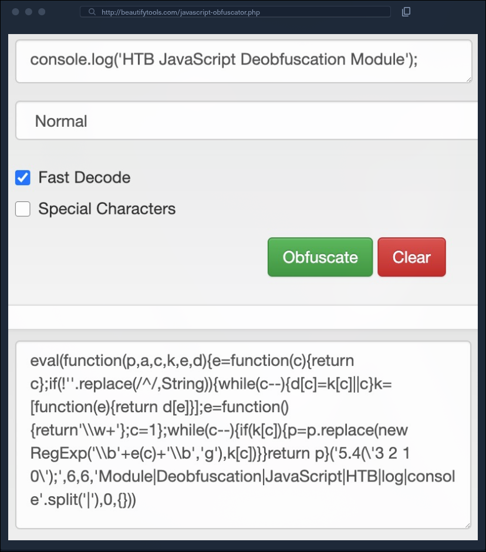

# Ofuscação de código

## O que é

Ofuscação é a transformação de um código para dificultar sua leitura e compreensão por humanos, preservando seu comportamento funcional. O programa continua sendo interpretado pela máquina, mas sua estrutura lógica passa a exigir mais esforço de análise.

Um ofuscador pode aplicar diferentes transformações automaticamente, como:

- substituir nomes descritivos por identificadores curtos;
- armazenar palavras e símbolos em tabelas ou dicionários;
- reconstruir strings durante a execução;
- alterar o fluxo de controle;
- inserir código irrelevante;
- empacotar o código para que ele seja reconstruído e executado dinamicamente.

## Exemplo visual

Mesmo que a versão ofuscada pareça completamente diferente, ela pode produzir o mesmo resultado da versão original.

## Por que JavaScript é frequentemente ofuscado

JavaScript do front-end é enviado ao navegador do usuário. Diferentemente da lógica de back-end em PHP ou Python, o código executado no cliente precisa ficar disponível localmente para o navegador interpretá-lo.

Isso permite que qualquer usuário:

- baixe o arquivo `.js`;
- formate e inspecione o código;
- acompanhe sua execução;
- examine strings e requisições;
- tente reproduzir sua lógica.

A ofuscação aumenta o esforço necessário para essas atividades, mas não impede definitivamente a análise.

## Ofuscação versus outros conceitos

| Conceito | Objetivo principal |
| --- | --- |
| Ofuscação | Dificultar a compreensão do código. |
| Minificação | Reduzir o tamanho do arquivo e melhorar a entrega. |
| Codificação | Representar dados em outro formato. |
| Criptografia | Proteger dados com um algoritmo e normalmente uma chave. |
| Compilação | Traduzir código para outra representação executável. |

Essas técnicas podem ser combinadas. Código minificado, por exemplo, pode parecer ofuscado, mas seu objetivo predominante pode ser apenas reduzir tamanho.

## Casos de uso legítimos

- dificultar cópia direta de uma implementação;
- elevar o custo da engenharia reversa;
- proteger parcialmente regras de negócio distribuídas no cliente;
- reduzir a exposição imediata de detalhes internos;
- proteger aplicações distribuídas em ambientes que o desenvolvedor não controla.

Ofuscação é uma barreira de esforço, não uma fronteira de segurança.

## Limitações de segurança

Qualquer segredo necessário para o funcionamento do código no navegador precisa estar disponível, direta ou indiretamente, durante sua execução. Um analista pode observar o código depois que strings são reconstruídas ou interceptar valores em tempo de execução.

Por isso:

- autenticação deve ser validada no servidor;
- decisões de autorização não devem depender somente do cliente;
- chaves secretas não devem ser incorporadas ao JavaScript entregue ao usuário;
- criptografia sensível deve usar arquitetura e gerenciamento de chaves apropriados;
- ofuscação não deve ser considerada substituta de controles de segurança.

## Uso malicioso

Agentes maliciosos podem ofuscar scripts para esconder:

- URLs e endereços de infraestrutura;
- carregamento de payloads adicionais;
- coleta ou exfiltração de dados;
- chamadas a APIs perigosas;
- indicadores que seriam reconhecidos por assinaturas simples.

O objetivo pode ser dificultar tanto a análise humana quanto a detecção por mecanismos baseados em padrões. Soluções modernas também analisam comportamento, contexto e conteúdo após decodificação, portanto a ofuscação não garante evasão.

## Impacto sobre o desempenho

Algumas transformações adicionam processamento em tempo de execução para reconstruir strings, resolver tabelas ou reorganizar o fluxo. Isso pode:

- aumentar o tamanho do arquivo;
- atrasar a inicialização;
- elevar o uso de CPU e memória;
- dificultar depuração e manutenção;
- produzir erros diferentes entre ambientes.

Nem toda ofuscação causa impacto perceptível, mas camadas complexas podem tornar o código mais lento.

## Estratégia inicial de análise

1. Preserve o arquivo original.
2. Formate o código para revelar sua estrutura.
3. Identifique a função ou expressão executada primeiro.
4. Localize tabelas de strings e funções de decodificação.
5. Procure `eval()`, `Function()` e outras formas de execução dinâmica.
6. Extraia uma camada por vez e compare os resultados.
7. Observe comportamento e requisições em ambiente isolado.
8. Renomeie funções e variáveis conforme seu propósito ficar claro.

## Pontos-chave para revisão

- Ofuscação preserva o comportamento e dificulta a leitura.
- JavaScript é um alvo comum porque seu código é entregue ao cliente.
- Dicionários de palavras e reconstrução dinâmica são técnicas recorrentes.
- Ofuscação pode proteger propriedade intelectual, mas não protege segredos de forma confiável.
- Autenticação e autorização devem ser impostas no servidor.
- Código malicioso também usa ofuscação para dificultar análise e detecção.
- Compreender como o código é ofuscado facilita sua desofuscação.
