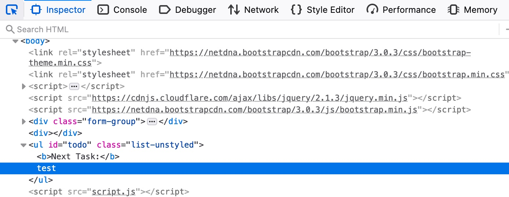

# DOM XSS

O terceiro e último tipo de XSS é outro tipo não persistente chamado DOM-based XSS. Enquanto o Reflected XSS envia os dados de entrada ao servidor de back-end por meio de requisições HTTP, o DOM XSS é processado inteiramente no lado do cliente por JavaScript. O DOM XSS ocorre quando o JavaScript é usado para alterar a página por meio do Document Object Model (DOM).

Podemos executar o servidor abaixo para ver um exemplo de aplicação web vulnerável a DOM XSS. Podemos tentar adicionar um item de teste e veremos que a aplicação é semelhante às aplicações de lista de tarefas (To-Do List) utilizadas anteriormente:

<a href="../img/xss8.png">
  
</a>

Entretanto, se abrirmos a aba **Network** nas ferramentas de desenvolvedor do Firefox e adicionarmos novamente o item de teste, perceberemos que nenhuma requisição HTTP é realizada:

<a href="../img/xss9.png">
  
</a>

Vemos que o parâmetro de entrada na URL utiliza uma cerquilha `#` para o item adicionado, o que significa que esse é um parâmetro do lado do cliente, processado inteiramente pelo navegador. Isso indica que a entrada é processada no lado do cliente por JavaScript e nunca chega ao back-end; portanto, trata-se de DOM-based XSS.

Além disso, se examinarmos o código-fonte da página pressionando `CTRL+U`, perceberemos que nossa string de teste não aparece em lugar algum. Isso acontece porque o código JavaScript atualiza a página quando clicamos no botão **Add**, depois que o navegador já obteve o código-fonte da página. Por isso, o código-fonte base não mostrará nossa entrada e, se atualizarmos a página, ela não será mantida (ou seja, é não persistente). Ainda podemos visualizar o código renderizado da página usando a ferramenta Web Inspector ao pressionar `CTRL+SHIFT+C`:

<a href="../img/xss10.png">
  
</a>

## Source e Sink

Para compreender melhor a natureza da vulnerabilidade DOM-based XSS, devemos entender os conceitos de Source e Sink do objeto exibido na página. A Source é o objeto JavaScript que recebe a entrada do usuário e pode ser qualquer parâmetro de entrada, como um parâmetro de URL ou um campo de entrada, conforme vimos anteriormente.

Por outro lado, o Sink é a função que escreve a entrada do usuário em um objeto DOM da página. Se a função Sink não sanitizar corretamente a entrada do usuário, ela poderá estar vulnerável a um ataque XSS. Algumas funções JavaScript usadas com frequência para escrever em objetos DOM são:

```javascript
document.write()
DOM.innerHTML
DOM.outerHTML
```

Além disso, algumas funções da biblioteca jQuery que escrevem em objetos DOM são:

```javascript
add()
after()
append()
```

Se uma função Sink escrever exatamente a entrada recebida sem nenhuma sanitização, como as funções acima podem fazer, e nenhum outro mecanismo de sanitização for utilizado, saberemos que a página provavelmente está vulnerável a XSS.

Podemos examinar o código-fonte da aplicação To-Do, verificar o arquivo `script.js` e observar que a Source é obtida do parâmetro `task=`:

```javascript
var pos = document.URL.indexOf("task=");
var task = document.URL.substring(pos + 5, document.URL.length);
```

Logo abaixo dessas linhas, vemos que a página utiliza a propriedade `innerHTML` para escrever a variável `task` no elemento DOM `todo`:

```javascript
document.getElementById("todo").innerHTML = "<b>Next Task:</b> " + decodeURIComponent(task);
```

Portanto, vemos que podemos controlar a entrada e que a saída não está sendo sanitizada, de modo que essa página deve estar vulnerável a DOM XSS.

## Ataques DOM

Se tentarmos usar o payload XSS empregado anteriormente, veremos que ele não será executado. Isso ocorre porque, como recurso de segurança, a propriedade `innerHTML` não permite a execução de tags `<script>` inseridas dessa forma. Ainda assim, existem muitos outros payloads XSS que não contêm tags `<script>`, como o seguinte:

```html

```

A linha acima cria um novo objeto de imagem HTML com um atributo `onerror`, capaz de executar código JavaScript quando a imagem não é encontrada. Como fornecemos um link de imagem vazio (`""`), nosso código deve ser executado sem a necessidade de usar tags `<script>`:

<a href="../img/xss11.png">
  
</a>

Para atingir um usuário com essa vulnerabilidade DOM XSS, podemos novamente copiar a URL do navegador e compartilhá-la. Quando a vítima visitar essa URL, o código JavaScript deverá ser executado. Esses payloads estão entre os exemplos mais básicos de XSS. Existem muitas situações nas quais pode ser necessário usar payloads diferentes, dependendo das proteções da aplicação web e do navegador, assunto que será discutido na próxima seção.
