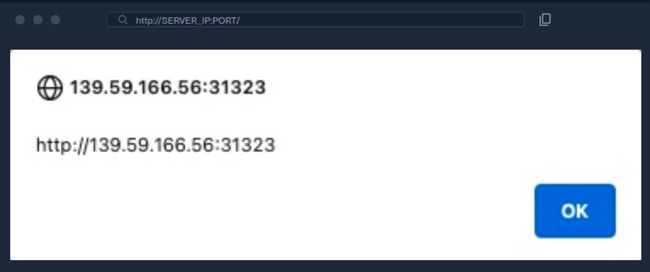

# XSS armazenado (Stored XSS)

Antes de aprendermos a descobrir vulnerabilidades XSS e utilizá-las em vários ataques, devemos primeiro compreender os diferentes tipos de vulnerabilidade XSS e suas diferenças, para sabermos qual usar em cada tipo de ataque.

O primeiro e mais crítico tipo de vulnerabilidade XSS é o XSS armazenado (Stored XSS), também chamado de XSS persistente (Persistent XSS). Se o payload XSS injetado for armazenado no banco de dados do back-end e recuperado quando a página for visitada, isso significa que o ataque XSS é persistente e pode afetar qualquer usuário que visite a página.

Isso torna esse tipo de XSS o mais crítico, pois ele afeta um público muito maior: qualquer usuário que visite a página será vítima do ataque. Além disso, o Stored XSS pode não ser facilmente removível, e talvez seja necessário excluir o payload diretamente do banco de dados do back-end.

Podemos iniciar o servidor abaixo para visualizar e praticar um exemplo de Stored XSS. Como podemos ver, a página web é uma aplicação simples de lista de tarefas (To-Do List), à qual podemos adicionar itens. Podemos tentar digitar `test` e pressionar Enter/Return para adicionar um novo item e observar como a página o processa:

<a href="../xss2.png">
  
</a>

Como podemos ver, nossa entrada foi exibida na página. Se nenhuma sanitização ou filtragem tiver sido aplicada à entrada, a página poderá estar vulnerável a XSS.

## Payloads para teste de XSS

Podemos testar se a página está vulnerável a XSS com o seguinte payload XSS básico:

```html
<script>alert(window.origin)</script>
```

Usamos esse payload porque ele oferece uma forma muito fácil de perceber quando o payload XSS foi executado com sucesso. Suponha que a página aceite qualquer entrada e não realize nenhuma sanitização. Nesse caso, imediatamente após inserirmos o payload ou atualizarmos a página, deverá aparecer uma caixa de alerta com a URL da página na qual ele está sendo executado:

<a href="../xss3.png">
  
</a>

Como podemos ver, a caixa de alerta realmente apareceu, o que significa que a página está vulnerável a XSS, pois o payload foi executado com sucesso. Podemos confirmar isso examinando o código-fonte da página ao pressionar `CTRL+U` ou clicar com o botão direito e selecionar **View Page Source**. Deveremos ver o payload no código-fonte:

```html
<div></div><ul class="list-unstyled" id="todo"><ul><script>alert(window.origin)</script>
</ul></ul>
```

> **Dica:** muitas aplicações web modernas utilizam IFrames entre domínios (cross-domain IFrames) para processar entradas do usuário. Dessa forma, mesmo que o formulário web esteja vulnerável a XSS, isso não significa que a vulnerabilidade esteja na aplicação web principal. É por isso que mostramos o valor de `window.origin` na caixa de alerta, em vez de um valor estático como `1`. Nesse caso, a caixa de alerta revela a URL na qual o código está sendo executado e confirma qual formulário é o vulnerável caso um IFrame esteja sendo utilizado.

Como alguns navegadores modernos podem bloquear a função JavaScript `alert()` em locais específicos, pode ser útil conhecer outros payloads XSS básicos para verificar a existência da vulnerabilidade. Um deles é `<plaintext>`, que interrompe a renderização do código HTML que vem depois dele e o exibe como texto simples. Outro payload fácil de perceber é `<script>print()</script>`, que abre a caixa de diálogo de impressão do navegador, algo que dificilmente será bloqueado. Experimente esses payloads para observar como cada um funciona. Você pode usar o botão de redefinição (reset) para remover os payloads atuais.

Para verificar se o payload é persistente e está armazenado no back-end, podemos atualizar a página e observar se a caixa de alerta aparece novamente. Se isso acontecer, veremos que o alerta continua surgindo mesmo após sucessivas atualizações da página, confirmando que se trata de uma vulnerabilidade Stored/Persistent XSS. O efeito não se restringe a nós: qualquer usuário que visitar a página acionará o payload XSS e verá o mesmo alerta.
