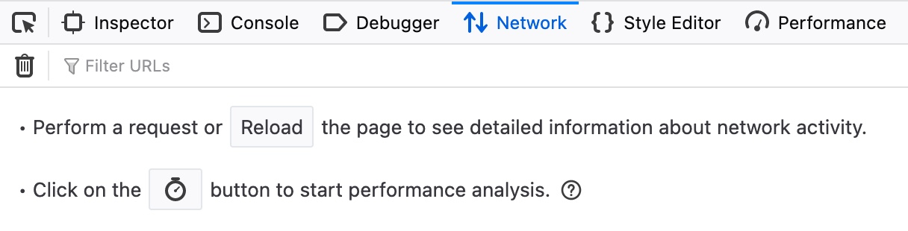

# DOM-based XSS

## O que é

DOM-based XSS é uma vulnerabilidade em que o fluxo inseguro ocorre no JavaScript executado pelo navegador. Dados controlados pelo usuário são lidos de uma **Source** e enviados a um **Sink** que os interpreta como HTML ou código, sem tratamento adequado.

Ao contrário do Reflected XSS, a entrada vulnerável pode nunca ser enviada ao back-end. A resposta HTTP original pode ser segura e estática, enquanto o JavaScript do cliente modifica o DOM de maneira perigosa após o carregamento.

## Como funciona

O fluxo básico é:

1. O navegador carrega a página e seu JavaScript.
2. O script lê um valor controlável, como um parâmetro ou fragmento da URL.
3. O valor é transformado ou decodificado.
4. Um Sink insere esse valor no DOM como conteúdo interpretável.
5. O navegador cria elementos ou executa eventos presentes na entrada maliciosa.

## Identificação no laboratório

<a href="../xss8.png">
  
</a>

A aplicação adiciona uma tarefa a partir da URL. A aba **Network** mostra que a ação não gera uma nova requisição HTTP:

<a href="../xss9.png">
  
</a>

O valor aparece depois de `#` na URL. Essa parte é o fragmento (*fragment identifier*) e não é enviada ao servidor nas requisições HTTP normais. O JavaScript da página pode, porém, lê-la e usá-la localmente.

Pressionar `CTRL+U` mostra apenas o HTML original recebido do servidor. Como a alteração acontece depois, é necessário inspecionar o DOM renderizado com as ferramentas de desenvolvedor, por exemplo com `CTRL+SHIFT+C`:

<a href="../xss10.png">
  
</a>

## Source e Sink

- **Source:** origem de dados controláveis, como `document.URL`, `location.href`, `location.search`, `location.hash`, `document.referrer` ou campos de formulário.
- **Sink:** API que consome esses dados e pode interpretá-los como HTML ou JavaScript, como `innerHTML`, `outerHTML` e `document.write()`.

No exemplo, a Source é `document.URL`:

```javascript
var pos = document.URL.indexOf("task=");
var task = document.URL.substring(pos + 5, document.URL.length);
```

O Sink é `innerHTML`:

```javascript
document.getElementById("todo").innerHTML = "<b>Next Task:</b> " + decodeURIComponent(task);
```

O dado controlável percorre o caminho Source → variável `task` → `decodeURIComponent()` → Sink. `decodeURIComponent()` apenas decodifica o valor; não é uma função de sanitização.

## Por que o payload com `script` pode falhar

Elementos `<script>` inseridos por meio de `innerHTML` normalmente não são executados pelo navegador. Isso não torna o Sink seguro, pois outros elementos HTML podem conter manipuladores de eventos executáveis.

O payload usado no material é:

```html

```

O navegador tenta carregar a imagem com `src` vazio. Quando ocorre o erro de carregamento, o manipulador `onerror` executa o JavaScript:

<a href="../xss11.png">
  
</a>

Esse comportamento demonstra por que bloquear apenas a tag `<script>` não é uma mitigação suficiente.

## DOM XSS versus Reflected XSS

| Característica | DOM-based XSS | Reflected XSS |
| --- | --- | --- |
| Processamento vulnerável | JavaScript no cliente | Resposta gerada pelo servidor |
| Payload precisa chegar ao servidor | Nem sempre | Sim |
| Onde inspecionar | DOM renderizado e scripts | Resposta HTTP e HTML retornado |
| Persistência | Geralmente não persistente | Não persistente |
| Entrega comum | URL com parâmetro ou fragmento | URL ou requisição com parâmetro refletido |

## Como testar em ambientes autorizados

1. Identifique entradas lidas pelo JavaScript, inclusive fragmentos de URL.
2. Procure o uso dessas entradas em Sinks perigosos.
3. Acompanhe as transformações entre Source e Sink.
4. Compare o código-fonte recebido com o DOM renderizado.
5. Use um marcador único antes de testar execução.
6. Escolha um payload compatível com o contexto do Sink.

A ausência do valor na resposta HTTP não descarta XSS. Em DOM XSS, análise estática do JavaScript, breakpoints e inspeção do DOM podem ser mais úteis que observar somente o tráfego de rede.

## Impacto

- Execução de ações com a sessão ativa da vítima.
- Leitura e alteração de informações disponíveis no DOM.
- Captura de dados digitados ou exibidos na página.
- Criação de interfaces falsas sob a origem confiável.
- Exfiltração de dados acessíveis ao JavaScript.

## Mitigação

- Para inserir texto, usar `textContent` em vez de `innerHTML` ou `outerHTML`.
- Criar elementos com APIs seguras, como `document.createElement()`, e definir atributos de maneira controlada.
- Evitar que dados não confiáveis alcancem Sinks que interpretam HTML ou código.
- Quando HTML fornecido pelo usuário for indispensável, usar uma biblioteca de sanitização confiável e bem configurada.
- Validar URLs e restringir esquemas e destinos permitidos quando o Sink espera uma URL.
- Adotar Trusted Types, quando compatível, para reduzir o uso acidental de Sinks DOM perigosos.
- Usar Content Security Policy (CSP) como camada adicional, sem substituir a correção do fluxo Source → Sink.

## Pontos-chave para revisão

- DOM XSS nasce no processamento do lado do cliente.
- Fragmentos após `#` normalmente não chegam ao servidor, mas continuam acessíveis ao JavaScript.
- `CTRL+U` mostra a resposta original; o Web Inspector mostra o DOM atual.
- A vulnerabilidade depende do fluxo entre uma Source controlável e um Sink perigoso.
- `decodeURIComponent()` não sanitiza conteúdo.
- Impedir `<script>` não basta: manipuladores de eventos também podem executar JavaScript.
