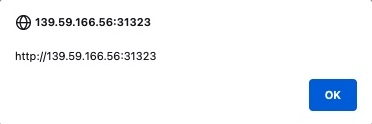
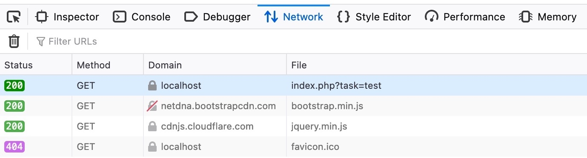

# Reflected XSS (XSS refletido)

## O que é

Reflected XSS é uma vulnerabilidade não persistente na qual uma entrada controlada pelo usuário é enviada ao servidor e refletida na resposta sem tratamento adequado. O navegador interpreta essa entrada como código, possibilitando a execução de JavaScript no contexto da aplicação vulnerável.

O payload não fica armazenado no back-end. Em geral, ele precisa estar presente em cada requisição maliciosa, frequentemente como parte de uma URL enviada à vítima.

## Como funciona

O fluxo típico é:

1. O atacante constrói uma requisição com uma entrada maliciosa.
2. O servidor recebe o valor e o inclui na resposta HTML.
3. A vítima acessa a URL ou envia a requisição preparada.
4. O navegador interpreta o conteúdo refletido como código.
5. O payload é executado sob a origem da aplicação vulnerável.

Mensagens de erro, resultados de busca e mensagens de confirmação são pontos comuns de reflexão.

## Demonstração do laboratório

<a href="../xss4.png">
  
</a>

Ao enviar `test`, a aplicação retorna:

```text
Task 'test' could not be added.
```

Isso mostra que a entrada foi refletida na resposta, mas ainda não confirma a vulnerabilidade. O material testa o mesmo payload usado no laboratório anterior:

```html
<script>alert(window.origin)</script>
```

<a href="../xss5.png">
  
</a>

Após o envio, o JavaScript é executado e uma caixa de alerta exibe a origem da página:

<a href="../xss6.png">
  
</a>

O código-fonte da resposta evidencia o contexto vulnerável:

```html
<div></div><ul class="list-unstyled" id="todo"><div style="padding-left:25px">Task '<script>alert(window.origin)</script>' could not be added.</div></ul>
```

A tag `<script>` é interpretada, e não exibida como texto. Por isso, a mensagem visível contém apenas aspas vazias no lugar do payload.

## Por que não é persistente

Ao abrir novamente a página sem repetir a requisição maliciosa, o erro e o payload desaparecem. O valor não foi salvo para ser entregue em visitas futuras.

Isso diferencia o Reflected XSS do Stored XSS:

| Característica | Reflected XSS | Stored XSS |
| --- | --- | --- |
| Armazenamento | Não é armazenado | É persistido no back-end |
| Entrega | Depende de uma requisição preparada | O conteúdo afetado entrega o payload |
| Alcance | Normalmente requer interação de cada vítima | Pode afetar todos que visualizarem o conteúdo |
| Persistência após atualização | Somente se a URL/requisição ainda contiver o payload | Geralmente continua presente |

## Como o ataque chega à vítima

No laboratório, a entrada é enviada por uma requisição GET. Como os parâmetros GET fazem parte da URL, o atacante pode preparar e compartilhar uma URL que provoque a reflexão do payload:

```text
http://SERVER_IP:PORT/
```

<a href="../xss7.png">
  
</a>

A vítima ainda precisa acessar a URL. Links encurtados, mensagens de phishing ou páginas intermediárias podem ocultar o conteúdo, razão pela qual entradas refletidas devem ser tratadas mesmo quando uma exploração direta parecer pouco conveniente.

## Como identificar em laboratórios

1. Insira um marcador único em parâmetros, formulários e cabeçalhos controláveis.
2. Procure esse marcador no corpo da resposta e no DOM renderizado.
3. Determine o contexto da reflexão: texto HTML, atributo, URL ou JavaScript.
4. Use a aba **Network** para identificar o método HTTP e os parâmetros enviados.
5. Verifique se uma requisição reproduzível contém toda a entrada necessária.
6. Teste somente em sistemas autorizados e com um payload compatível com o contexto.

Uma reflexão textual não é automaticamente XSS. A vulnerabilidade existe quando é possível romper o contexto e fazer o navegador interpretar a entrada como código executável.

## Impactos possíveis

- Execução de ações autenticadas em nome da vítima.
- Captura de informações disponíveis na página.
- Alteração do DOM e criação de formulários falsos.
- Roubo de cookies que não estejam protegidos por `HttpOnly`.
- Redirecionamento ou apresentação de conteúdo enganoso sob um domínio confiável.

## Mitigação

- Aplicar codificação de saída específica para o contexto da reflexão.
- Preferir APIs seguras, como `textContent`, quando a saída deve ser apenas texto.
- Validar entradas de acordo com o formato esperado como proteção complementar.
- Evitar inserir dados não confiáveis em blocos JavaScript, atributos de evento ou URLs executáveis.
- Preservar o escape automático dos frameworks.
- Usar uma Content Security Policy (CSP) restritiva como camada adicional.
- Proteger cookies com `HttpOnly`, `Secure` e um valor adequado de `SameSite`.

## Pontos-chave para revisão

- Reflected XSS passa pelo servidor, mas não é armazenado.
- A entrada maliciosa e a reflexão aparecem na mesma interação HTTP.
- Requisições GET facilitam o envio do payload por URL.
- A vítima normalmente precisa abrir um link ou enviar uma requisição preparada.
- A identificação e a correção dependem do contexto exato em que o dado é refletido.
- DOM-based XSS também é não persistente, mas seu fluxo vulnerável ocorre no cliente e pode não chegar ao servidor.
