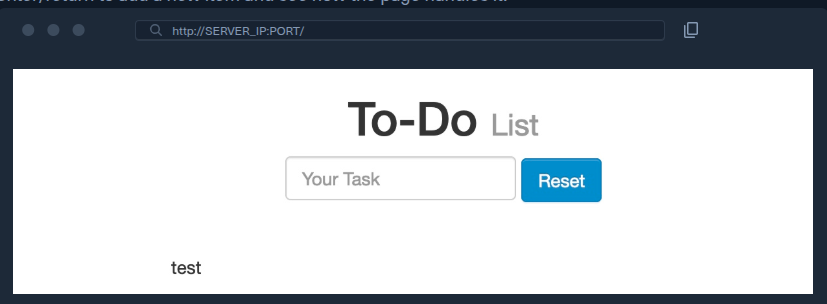

# Stored XSS (XSS armazenado)

## O que é

Stored XSS, ou XSS persistente, ocorre quando uma aplicação salva uma entrada maliciosa — normalmente em um banco de dados — e depois a inclui em páginas exibidas a outros usuários sem codificação ou sanitização adequada.

Diferentemente do Reflected XSS, o payload não precisa ser reenviado em cada ataque. Depois de armazenado, ele pode ser executado automaticamente sempre que alguém acessar o conteúdo afetado.

## Como funciona

O fluxo típico é:

1. O atacante envia uma entrada contendo um payload XSS.
2. A aplicação armazena esse conteúdo no back-end.
3. Uma página recupera o valor armazenado.
4. O valor é inserido no HTML sem tratamento seguro.
5. O navegador da vítima interpreta e executa o JavaScript.

Comentários, publicações, nomes de perfil, tickets de suporte e itens de listas são exemplos de pontos que podem armazenar dados exibidos posteriormente.

## Demonstração do laboratório

<a href="../img/xss2.png">
  
</a>

Na aplicação de lista de tarefas, uma entrada comum como `test` aparece na página. Isso comprova que o dado é renderizado, mas ainda não confirma XSS. O próximo passo é verificar, em ambiente autorizado, se a entrada é interpretada como código.

O payload de teste apresentado no material é:

```html
<script>alert(window.origin)</script>
```

Se a aplicação o inserir como HTML executável, a caixa de alerta mostrará a origem em que o script está rodando:

<a href="../img/xss3.png">
  
</a>

Usar `window.origin` ajuda a distinguir a origem principal de uma aplicação daquela de um IFrame. Um simples `alert(1)` demonstra execução, mas não informa em qual contexto o código está sendo executado.

## Como confirmar a persistência

- Atualize ou reabra a página.
- Acesse o mesmo conteúdo em outra sessão ou navegador de teste.
- Verifique se o payload permanece no código-fonte ou no DOM após ser recuperado.
- Confirme se a execução ocorre sem reenviar a entrada original.

Se o payload continuar sendo entregue após atualizações da página, há evidência de persistência no back-end ou em outro mecanismo de armazenamento. A inspeção do código-fonte pode mostrar, por exemplo:

```html
<div></div><ul class="list-unstyled" id="todo"><ul><script>alert(window.origin)</script>
</ul></ul>
```

## Payloads alternativos citados

Quando `alert()` é bloqueado ou modificado pelo navegador, o material sugere:

```html
<plaintext>
```

Esse elemento faz o conteúdo HTML posterior ser tratado como texto simples, alterando claramente a renderização.

```html
<script>print()</script>
```

Esse payload tenta abrir a caixa de diálogo de impressão. Esses exemplos servem apenas para confirmar o comportamento em laboratórios e ambientes autorizados.

## Por que é crítico

- Uma única inserção pode alcançar muitos usuários.
- A vítima pode acionar o payload apenas visitando a página.
- Usuários privilegiados, como administradores e equipes de suporte, também podem ser afetados.
- Remover a vulnerabilidade no código não necessariamente elimina payloads já armazenados.
- Pode ser necessário localizar e limpar registros maliciosos no banco de dados.

## Impactos possíveis

- Ações autenticadas em nome da vítima.
- Captura de dados acessíveis na página.
- Alteração da interface e criação de formulários falsos.
- Roubo de cookies que não estejam protegidos por `HttpOnly`.
- Propagação automática do payload entre usuários.

Mesmo quando `HttpOnly` impede a leitura direta do cookie, o script ainda pode utilizar a sessão ativa para fazer requisições e manipular dados acessíveis pela aplicação.

## Mitigação

- Aplicar codificação de saída conforme o contexto em que o dado será inserido: HTML, atributo, URL ou JavaScript.
- Preferir APIs que tratem a entrada como texto, como `textContent`, em vez de `innerHTML`.
- Sanitizar com uma biblioteca confiável quando for realmente necessário aceitar HTML de usuários.
- Manter o escape automático fornecido pelo framework e evitar funções que o desativem.
- Usar Content Security Policy (CSP) como defesa adicional, não como correção principal.
- Proteger cookies com `HttpOnly`, `Secure` e `SameSite` apropriado.
- Após corrigir o código, identificar e remover payloads já persistidos.

## Pontos-chave para revisão

- Stored XSS combina armazenamento no back-end com renderização insegura no cliente.
- A recorrência após atualizar a página é um forte indício de persistência.
- Visualizar uma entrada na página não basta para confirmar XSS; é necessário verificar se ela é interpretada como código.
- O contexto de execução, especialmente quando existem IFrames, é importante para avaliar o alcance real da vulnerabilidade.
- A correção exige tanto impedir novas inserções executáveis quanto tratar dados maliciosos que já foram armazenados.
