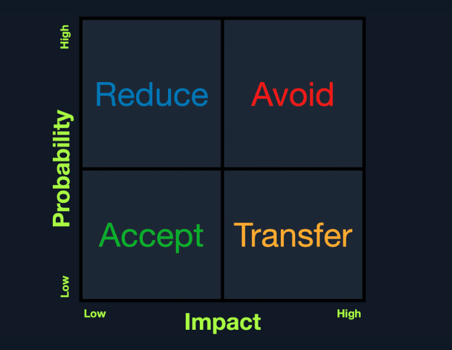

# Introdução ao Cross-Site Scripting (XSS)

## O que é

Cross-Site Scripting (XSS) é uma vulnerabilidade de aplicação web na qual dados controlados por um usuário são inseridos em uma página sem o tratamento adequado e acabam sendo interpretados pelo navegador como código JavaScript.

O problema central é a quebra da separação entre **dados** e **código**: um valor que deveria aparecer apenas como texto passa a fazer parte do HTML ou do JavaScript executável da página.

## Matriz de risco

A matriz ajuda a relacionar a probabilidade de exploração ao impacto causado. Como vulnerabilidades XSS são frequentes, mesmo cenários de impacto direto limitado exigem ações para reduzir o risco.

## Como funciona

O fluxo básico de um XSS é:

1. A aplicação recebe uma entrada controlável pelo usuário.
2. Essa entrada chega a um ponto de saída da página sem codificação ou sanitização adequada ao contexto.
3. O navegador interpreta parte da entrada como código.
4. O código é executado no contexto da origem (*origin*) da aplicação vulnerável.

Isso é importante porque o script injetado pode agir com os privilégios que a página possui no navegador. Dependendo das proteções existentes, ele pode ler ou alterar o DOM, realizar requisições autenticadas, capturar dados exibidos e induzir ações em nome da vítima.

## Tipos principais

| Tipo | Origem e comportamento | Exemplo comum |
| --- | --- | --- |
| **Stored XSS (persistente)** | O payload é salvo no back-end e entregue posteriormente às vítimas. | Comentário, perfil ou publicação. |
| **Reflected XSS (não persistente)** | A entrada enviada em uma requisição é devolvida imediatamente na resposta, sem armazenamento. | Pesquisa ou mensagem de erro. |
| **DOM-based XSS** | A vulnerabilidade ocorre no JavaScript do cliente, quando uma fonte controlável alimenta um ponto de execução perigoso; o dado pode nem chegar ao servidor. | Fragmento de URL processado e inserido no DOM. |

O XSS armazenado tende a apresentar risco elevado porque uma única inserção pode atingir muitos usuários sem que cada vítima precise enviar manualmente o payload.

## Fontes e pontos de execução

No XSS baseado em DOM, é útil distinguir:

- **Source (fonte):** local de onde vem o dado controlável, como `location.search`, `location.hash` ou `document.referrer`.
- **Sink (destino perigoso):** função ou propriedade capaz de interpretar o dado como HTML ou código, como `innerHTML`, `document.write()` ou `eval()`.

A vulnerabilidade surge quando dados não confiáveis fluem de uma fonte para um sink perigoso sem tratamento apropriado.

## Impactos possíveis

- Sequestro de sessão, quando cookies sensíveis estão acessíveis ao JavaScript.
- Execução de ações autenticadas em nome da vítima.
- Captura de credenciais ou de dados digitados na página.
- Alteração do conteúdo da interface e criação de formulários falsos.
- Redirecionamento para páginas maliciosas.
- Propagação automática, como ocorreu com o Samy Worm no MySpace.
- Em casos excepcionais, combinação com uma falha do próprio navegador para escapar da sandbox.

O atributo `HttpOnly` impede que JavaScript leia diretamente um cookie, mas não elimina o XSS: o script ainda pode executar ações por meio da sessão ativa e acessar informações disponíveis na página.

## Por que o navegador permite a ação

O código injetado passa a fazer parte da página vulnerável. Por isso, o navegador o executa sob a mesma origem da aplicação, considerando o esquema, o host e a porta. A Same-Origin Policy restringe o acesso direto a outras origens, mas não protege a própria aplicação contra scripts que ela mesma incorporou à página.

## Como identificar em laboratórios

1. Localize entradas controláveis, como parâmetros de URL, campos de formulário, cabeçalhos e fragmentos de URL.
2. Use um marcador textual único e verifique onde ele reaparece na resposta ou no DOM.
3. Determine o contexto da reflexão: texto HTML, atributo, URL, string JavaScript ou outro local.
4. Inspecione o HTML retornado e as alterações no DOM com as ferramentas de desenvolvedor do navegador.
5. Teste apenas payloads compatíveis com o contexto encontrado e dentro do ambiente autorizado.

Entender o contexto é essencial: uma defesa adequada para texto entre tags pode ser inadequada dentro de um atributo ou de uma string JavaScript.

## Mitigação

- Aplicar **codificação de saída contextual** (*context-aware output encoding*) no momento da renderização.
- Evitar sinks perigosos; para texto, preferir `textContent` a `innerHTML`.
- Quando HTML fornecido pelo usuário for realmente necessário, sanitizá-lo com uma biblioteca consolidada e configurada corretamente.
- Validar entradas como medida complementar, sem tratá-la como substituta da codificação de saída.
- Utilizar frameworks com escape automático e evitar mecanismos que desativem essa proteção.
- Configurar uma Content Security Policy (CSP) restritiva como camada adicional de defesa.
- Marcar cookies de sessão com `HttpOnly`, `Secure` e um valor de `SameSite` apropriado.

CSP e flags de cookies reduzem o impacto ou dificultam a exploração, mas não corrigem a causa do XSS. A correção principal continua sendo impedir que dados não confiáveis sejam interpretados como código.

## Casos históricos citados

- **Samy Worm (MySpace, 2005):** XSS armazenado que se replicou entre perfis e alcançou mais de um milhão de usuários em um dia.
- **TweetDeck (2014):** um XSS gerou um tweet autorreplicante, retuitado mais de 38 mil vezes em menos de dois minutos.
- Casos em serviços amplamente usados, como Google e Apache, mostram que XSS continua relevante mesmo em aplicações maduras.

## Pontos-chave para revisão

- XSS executa no navegador da vítima, não diretamente no servidor.
- A frequência da vulnerabilidade pode tornar o risco significativo mesmo quando o impacto direto no back-end é baixo.
- Stored, Reflected e DOM-based XSS diferem principalmente pelo caminho percorrido pelos dados e pelo local onde ocorre o processamento vulnerável.
- A exploração e a mitigação dependem do contexto exato em que a entrada é inserida.
- Uma defesa robusta combina codificação contextual, APIs seguras, sanitização quando necessária e camadas adicionais como CSP e cookies protegidos.
